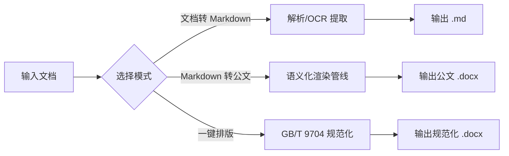

<div align="center">

# Doc2MD Converter

**Windows 离线文档转换与中文公文排版工具**

[](LICENSE)


[English](docs/README.en.md) · [更新日志](CHANGELOG.md)

</div>

批量文档输入 → 格式转换 / 公文排版 → 输出到指定目录。面向政企办公场景，内置 GB/T 9704-2012 公文格式标准，支持中英文界面。所有处理均在本地完成，**文档内容绝不上传**。


## 功能特性

### 1. 文档转 Markdown

支持以下格式批量转换为 Markdown：

| 格式 | 说明 |
|------|------|
| PDF | 文本型直接解析；扫描型可选 OCR 增强 |
| DOC / DOCX | Word 文档（旧式 .doc 通过 LibreOffice / COM 双降级转换） |
| XLS / XLSX | Excel 表格，保留表格结构 |
| PPT / PPTX | 演示文稿文本提取 |
| TXT / Markdown | 直接复制 |

- 保留标题层级、表格、列表、引用、代码块等结构
- 自动提取文档元数据（文号、发文机关、日期、公文类型、主题词）
- 自动移除 AIGC 水印（frontmatter、零宽字符等 6 类）
- 质量评分与导入建议（推荐 / 复核 / 跳过）

### 2. Markdown 转公文 DOCX

- 符合 GB/T 9704-2012《党政机关公文格式》标准
- 内置三种模板：正式公文（official-report）、会议纪要（meeting-minutes）、巡察报告（inspection-report）
- 支持自定义 Word 模板（克隆模板样式与节设置）
- 支持目录生成、页眉页脚、正文中文字体（方正小标宋简体 / 黑体 / 仿宋_GB2312 / 楷体_GB2312）

### 3. DOC / DOCX 一键规范排版

- 按 GB/T 9704-2012 自动规范化字体、字号、行距、页边距、首行缩进
- 内置三种排版方案：标准公文格式 / 企业增强版 / 学术论文格式
- 支持排版方案导入导出

## 快速开始

**最终用户（无需编译）：**

1. 前往 [Releases](../../releases) 下载最新版 Windows 安装包（自包含单文件，免安装 .NET）
2. 解压后双击 `Doc2MD.Converter.exe`
3. 将待转换文档拖入窗口（或点击"添加文件 / 添加文件夹"）
4. 选择输出目录，点击「生成」，在输出目录查看结果

**开发者：** 见下方 [构建与运行](#构建与运行)。

## 使用示例

以「文档转 Markdown」为例，拖入 PDF / Word 文档后一键输出：

```text
输入：会议纪要.docx（含标题、表格、列表）
        │
        ▼
输出：会议纪要.md

# 会议纪要

## 会议时间
2026-08-12 09:30

| 议题 | 结论 |
|------|------|
| 上半年经营分析 | 通过 |

- 项目A：按计划推进
- 项目B：需协调资源
```

「Markdown 转公文 DOCX」则按 GB/T 9704-2012 自动套用公文版式，一键产出可直接打印的正式公文。

## 界面与交互

- 三模式卡片切换（文档转 Markdown / Markdown 转 DOCX / 一键排版）
- 拖拽添加文件或文件夹，批量处理，实时进度
- 转换预览面板（Markdown 语义渲染）
- 转换历史记录（最近 20 条）
- 快捷键：Ctrl+O 添加文件、Ctrl+Shift+O 添加文件夹、F5 刷新、Ctrl+Enter 开始、Esc 取消、Ctrl+Z 撤销清空
- 首次启动引导教程
- 中英文界面切换（设置中更改）

## 技术架构

```
Doc2MD.Converter.slnx
├── src/Doc2MD.Converter.Core/    # 核心引擎（.NET 8，无 UI 依赖）
│   ├── Parsers/                  # 各格式解析器（PDF/Word/Excel/PPT/Text）
│   ├── Pipeline/                 # Markdown→DOCX 语义化渲染管线
│   ├── Services/                 # 转换、排版、OCR、安全策略、更新检查等
│   └── Models/                   # 配置、结果、元数据模型
├── src/Doc2MD.Converter.App/     # WPF 桌面应用（.NET 8 / Windows）
│   ├── ViewModels/               # MVVM 视图模型
│   ├── Resources/                # 中英文字符串资源（Strings.resx / Strings.en.resx）
│   └── Controls/                 # 模式卡片等自定义控件
├── tests/                        # 单元测试与 E2E 测试（xUnit，295+ 用例）
│   └── fixtures/                 # 脱敏测试样例
└── scripts/                      # 构建 / 发布 / 冒烟测试脚本
```

处理流程：



## 环境要求

- Windows 10 / 11（64 位）
- .NET 8 SDK（构建时）；运行时支持自包含发布（免安装 .NET）

可选外部工具（缺失时给出清晰提示，不影响主流程）：

| 工具 | 用途 |
|------|------|
| LibreOffice | 旧式 .doc / .xls / .ppt 二进制 Office 格式转换 |
| OCRmyPDF + Tesseract (chi_sim) | 扫描型 PDF 的 OCR 识别 |

## 构建与运行

```powershell
# 构建
dotnet build Doc2MD.Converter.slnx

# 运行测试
dotnet test tests/Doc2MD.Converter.Core.Tests/Doc2MD.Converter.Core.Tests.csproj

# 运行 GUI
dotnet run --project src/Doc2MD.Converter.App

# 发布自包含单文件（win-x64）
.\scripts\publish-win-x64.ps1
```

发布产物位于 `publish/gui/`，模板按需复制至 `publish/templates/`。

## 安全与隐私

- **完全离线**：默认不联网，文档内容不上传
- OCR、LibreOffice 等外部工具仅从本地路径调用
- 内置安全策略：路径隔离、覆盖保护、文件类型与大小限制、Windows 保留名净化
- 可选的自动更新检查：仅轮询 GitHub Releases 接口，不自动下载安装，由用户确认跳转下载页

## 相关链接

- [English README](docs/README.en.md)
- [更新日志 (CHANGELOG)](CHANGELOG.md)
- [Releases](../../releases)

## 从源码开始贡献

1. Fork 本仓库并克隆到本地
2. 安装 .NET 8 SDK
3. 运行 `dotnet build` 确认构建通过
4. 编写/修改代码，补充相应单元测试
5. 运行 `dotnet test` 确保全部用例通过
6. 提交 Pull Request（请在提交信息中注明改动类别与原因）

## 许可证

MIT License，见 [LICENSE](LICENSE)。

