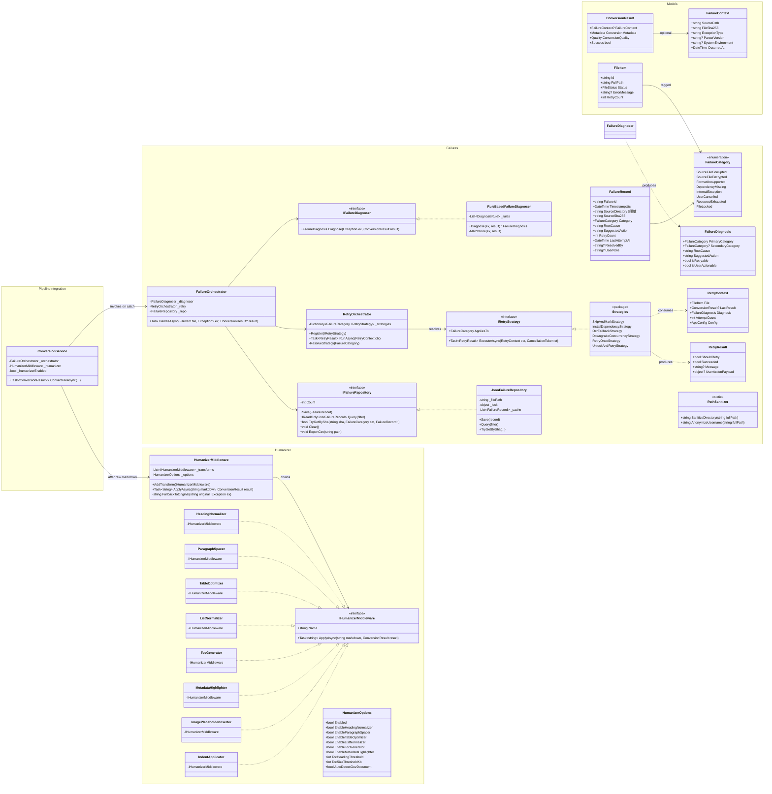
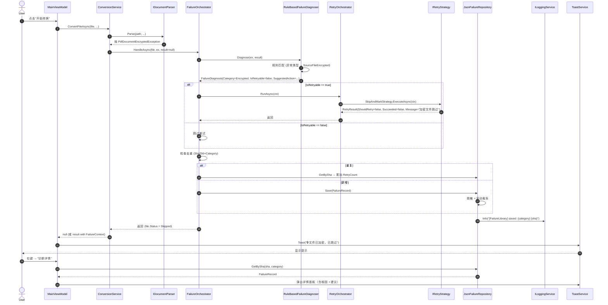
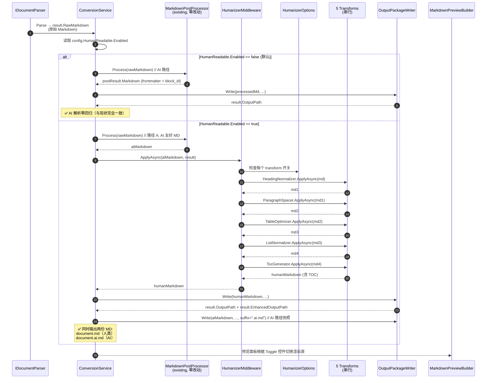
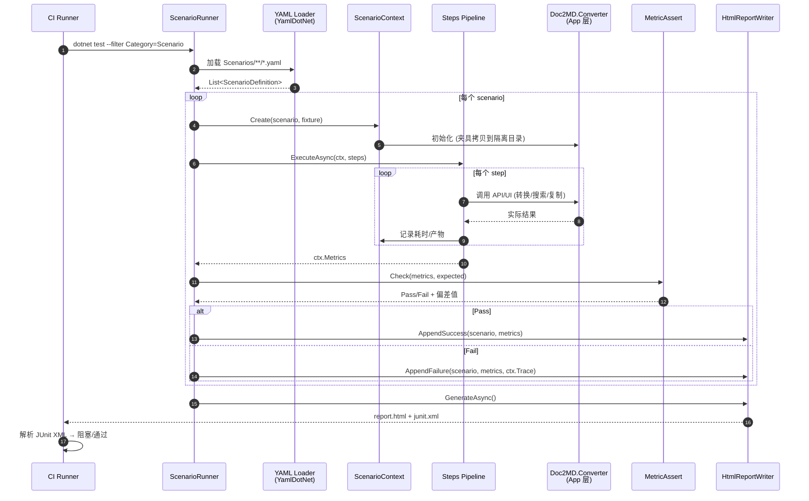
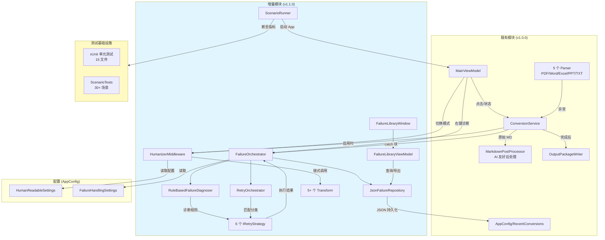
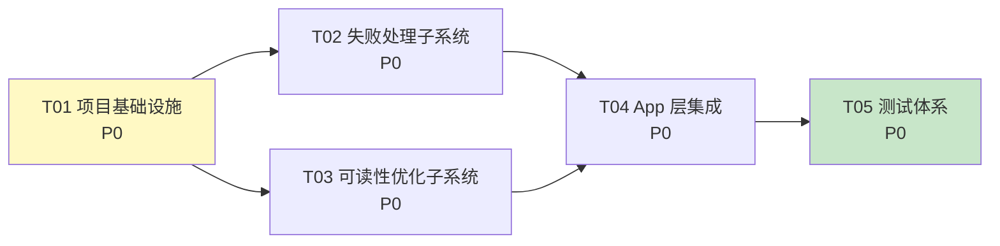

# Doc2MD-Converter 增量架构设计文档（v1.1.0）

> **文档版本**：v1.0
> **撰写日期**：2026-09-14
> **撰写人**：高见远（Gao）/ 架构师
> **基线版本**：v1.0.0（2026-08-12 发布）
> **输入物**：增量 PRD `doc2md-increment-prd-2026-09-14.md`、系统性审查报告 2026-09-14、CHANGELOG v1.0.0
> **目标版本**：v1.1.0（2026-Q4）
> **写作范围**：仅增量设计（失败处理 / MD 可读性 / 真实场景测试），不重复 v1.0.0 已落地的设计

---

## 0. 文档说明

### 0.1 文档结构

| 部分 | 内容 | 章节 |
|------|------|------|
| Part A 系统设计 | 实现方案 / 文件清单 / 数据模型 / 调用流程 / 待澄清 | §1 ~ §5 |
| Part B 任务分解 | 依赖 / 任务列表 / 共享知识 / 依赖图 | §6 ~ §9 |

### 0.2 与既有设计的关系

| 既有内容（v1.0.0） | 增量动作 |
|---------------------|----------|
| `ConversionResult`（核心）+ `ConversionMetadata`（来源/统计）+ `ConversionQuality`（警告/评分） | **不破坏**：在 `ConversionResult` 上**新增**可选 `FailureContext` 属性；Quality 不动 |
| `MarkdownPostProcessor`（静态后处理：去 AIGC、注 frontmatter、注 block_id） | **不破坏**：本设计引入 `HumanizerMiddleware` 作为可选中间件，**关闭时与现状完全一致** |
| `ConversionService`（含 try/catch + OperationCanceledException 区分） | **不破坏**：失败分类/重试/入库作为**新增旁路**，在 `catch` 中调用 `FailureOrchestrator` 编排 |
| `LoggingService`（门面）+ `FileLoggingService`（实例） | **复用**：失败库与重试日志统一走 `ILoggingService`，保证一致 |
| 单元测试（xUnit，15 文件 ~295+ 用例） | **扩展**：新增 `ScenarioTests/`、`FailureHandling.Tests`、`Humanizer.Tests` |

---

# Part A：系统设计

## 1. 实现方案（Implementation Approach）

### 1.1 三大设计挑战

| 挑战 | 关键决策 | 理由 |
|------|----------|------|
| **D-01**：AI 路径零回归 vs 人类路径增强 | **双轨管线 + 中间件可关闭** | PRD REQ-M-12/13/14 硬约束：AI 解析是核心契约，可读性是增量价值 |
| **D-02**：失败处理需要「诊断 + 决策 + 执行」三段分离 | **Diagnoser + Strategy + Orchestrator 三层抽象** | 8 类失败各有独立策略，新增枚举零侵入（NF-M-01） |
| **D-03**：场景测试需要「用户视角」而非「代码逻辑」 | **Scenario 抽象 + YAML 数据驱动 + FlaUI 编排** | PRD REQ-T-01 ~ T-05：可观察指标、可断言、可与单元测试分离 |

### 1.2 选型决策

| 类别 | 选择 | 替代方案 | 决策依据 |
|------|------|----------|----------|
| **失败库存储** | **JSON 单文件**（`failures.json` + 启动时全量加载，>1000 条启用滚动） | A) LiteDB（OQ-01 推荐） B) SQLite | **PRD 强调「不引入新 NuGet」**；JSON 文件 < 5 MB 完全够用，且与 `AppConfig` 同一目录便于备份 |
| **UI 自动化框架** | **FlaUI 3.x**（OQ-02 推荐） | WinAppDriver（已停维护） | 社区活跃、纯托管、无外部服务依赖 |
| **场景数据格式** | **YAML**（PRD REQ-T-07 推荐） | JSON / TOML | YamlDotNet 已是 .NET 生态事实标准，QA 可独立编写 |
| **可读性优化** | **纯 BCL 实现**（不引 NuGet，REQ-M-12） | Markdig / CommonMark | PRD 明确「不引入额外 NuGet 依赖」；5 个 transform 用 `Regex` + `StringBuilder` 即可 |
| **DI 容器** | **沿用** `Microsoft.Extensions.DependencyInjection`（已用） | Autofac / Lamar | 零迁移成本 |
| **事件总线（轻量）** | **C# event/delegate**（不引 MediatR） | MediatR | Orchestrator 内调用即可，无须独立抽象 |

> **结论**：**不引入任何新 NuGet 依赖**（除 `FlaUI.UIA3` + `YamlDotNet` + `BenchmarkDotNet`，均在测试项目，不污染发布版）。

### 1.3 架构模式

| 模块 | 模式 | 理由 |
|------|------|------|
| 失败处理 | **Strategy + Mediator（轻量）** | 每类失败匹配一个 `IRetryStrategy`；`RetryOrchestrator` 居中调度 |
| 可读性优化 | **Pipeline / Chain of Responsibility** | 5 个 transform 串联，Open/Closed 原则 |
| 场景测试 | **Data-Driven + Page Object（轻量）** | YAML 数据 + 极简 Page Object，避免过度抽象 |
| 失败库 | **Repository + Unit of Work（轻量）** | JSON 文件读写加锁 |
| UI 集成 | **MVVM**（沿用） | 与 `MainViewModel` 现有模式一致 |

---

## 2. 文件清单（File List）

### 2.1 生产代码新增文件

#### 2.1.1 Core 层 — 失败处理子系统

| 路径 | 用途 | 估算行数 |
|------|------|----------|
| `src/Doc2MD.Converter.Core/Failures/FailureCategory.cs` | 8 类失败枚举 + 元数据（标签/可重试/推荐策略） | 80 |
| `src/Doc2MD.Converter.Core/Failures/FailureContext.cs` | 失败上下文（异常/文件/环境/Parser 版本） | 60 |
| `src/Doc2MD.Converter.Core/Failures/FailureRecord.cs` | 失败记录实体（含脱敏路径 + SHA256） | 100 |
| `src/Doc2MD.Converter.Core/Failures/IFailureRepository.cs` | 仓储接口 | 40 |
| `src/Doc2MD.Converter.Core/Failures/JsonFailureRepository.cs` | JSON 单文件实现（含锁/滚动） | 180 |
| `src/Doc2MD.Converter.Core/Failures/IFailureDiagnoser.cs` | 诊断器接口 | 30 |
| `src/Doc2MD.Converter.Core/Failures/RuleBasedFailureDiagnoser.cs` | 规则引擎（异常类型→分类） | 220 |
| `src/Doc2MD.Converter.Core/Failures/IRetryStrategy.cs` | 重试策略接口 | 50 |
| `src/Doc2MD.Converter.Core/Failures/Strategies/SkipAndMarkStrategy.cs` | 加密/格式异常 → 跳过并标记 | 60 |
| `src/Doc2MD.Converter.Core/Failures/Strategies/InstallDependencyStrategy.cs` | 依赖缺失 → 弹安装按钮 | 80 |
| `src/Doc2MD.Converter.Core/Failures/Strategies/OcrFallbackStrategy.cs` | 损坏 → OCR 兜底 | 100 |
| `src/Doc2MD.Converter.Core/Failures/Strategies/DowngradeConcurrencyStrategy.cs` | 资源不足 → 单线程 + GC | 70 |
| `src/Doc2MD.Converter.Core/Failures/Strategies/RetryOnceStrategy.cs` | 内部异常 → 重试 1 次 | 50 |
| `src/Doc2MD.Converter.Core/Failures/Strategies/UnlockAndRetryStrategy.cs` | 文件占用 → 30 秒后重试 | 70 |
| `src/Doc2MD.Converter.Core/Failures/RetryOrchestrator.cs` | 调度器（分类→策略→执行） | 200 |
| `src/Doc2MD.Converter.Core/Failures/FailureOrchestrator.cs` | 失败入口（被 ConversionService 调用） | 100 |
| `src/Doc2MD.Converter.Core/Failures/PathSanitizer.cs` | 路径脱敏（去用户名） | 50 |

**小计：~1540 行**

#### 2.1.2 Core 层 — 可读性优化子系统

| 路径 | 用途 | 估算行数 |
|------|------|----------|
| `src/Doc2MD.Converter.Core/Humanizer/IHumanizerMiddleware.cs` | 中间件接口 | 30 |
| `src/Doc2MD.Converter.Core/Humanizer/HumanizerMiddleware.cs` | 总线（按顺序执行 5 个 transform） | 150 |
| `src/Doc2MD.Converter.Core/Humanizer/HumanizerOptions.cs` | 5 个 transform 独立开关 + 阈值 | 60 |
| `src/Doc2MD.Converter.Core/Humanizer/Transforms/HeadingNormalizer.cs` | 标题层级规范化（REQ-M-01） | 100 |
| `src/Doc2MD.Converter.Core/Humanizer/Transforms/ParagraphSpacer.cs` | 段落间距（REQ-M-02） | 60 |
| `src/Doc2MD.Converter.Core/Humanizer/Transforms/TableOptimizer.cs` | 表格列对齐/拆分（REQ-M-03） | 120 |
| `src/Doc2MD.Converter.Core/Humanizer/Transforms/ListNormalizer.cs` | 列表规范（REQ-M-04） | 80 |
| `src/Doc2MD.Converter.Core/Humanizer/Transforms/CodeAndQuoteBlockFormatter.cs` | 代码块/引用（REQ-M-05） | 60 |
| `src/Doc2MD.Converter.Core/Humanizer/Transforms/TocGenerator.cs` | 自动 TOC（REQ-M-06） | 150 |
| `src/Doc2MD.Converter.Core/Humanizer/Transforms/MetadataHighlighter.cs` | 文号/机关/日期加粗（REQ-M-07） | 100 |
| `src/Doc2MD.Converter.Core/Humanizer/Transforms/ImagePlaceholderInserter.cs` | 图片占位+图注（REQ-M-08） | 80 |
| `src/Doc2MD.Converter.Core/Humanizer/Transforms/IndentApplicator.cs` | 中文首行缩进（REQ-M-10） | 50 |

**小计：~1040 行**

#### 2.1.3 App 层 — UI 集成

| 路径 | 用途 | 估算行数 |
|------|------|----------|
| `src/Doc2MD.Converter.App/ViewModels/FailureLibraryViewModel.cs` | 失败案例库 DataGrid ViewModel | 250 |
| `src/Doc2MD.Converter.App/ViewModels/RetryOrchestratorViewModel.cs` | 右键"诊断并重试"动作 | 80 |
| `src/Doc2MD.Converter.App/Dialogs/FailureLibraryWindow.xaml(.cs)` | 失败库窗口 | 200 |
| `src/Doc2MD.Converter.App/Controls/HumanReadableToggle.xaml(.cs)` | 双轨切换控件 | 60 |

**小计：~590 行**

### 2.2 测试代码新增文件

#### 2.2.1 Core 单元测试扩展

| 路径 | 用途 | 估算行数 |
|------|------|----------|
| `tests/Doc2MD.Converter.Core.Tests/FailureHandling/FailureCategoryTests.cs` | 枚举元数据测试 | 80 |
| `tests/Doc2MD.Converter.Core.Tests/FailureHandling/FailureDiagnoserTests.cs` | 诊断器测试 | 150 |
| `tests/Doc2MD.Converter.Core.Tests/FailureHandling/RetryStrategyTests.cs` | 6 类策略单元测试 | 300 |
| `tests/Doc2MD.Converter.Core.Tests/FailureHandling/JsonFailureRepositoryTests.cs` | 仓储 + 去重 + 滚动 | 150 |
| `tests/Doc2MD.Converter.Core.Tests/FailureHandling/PathSanitizerTests.cs` | 路径脱敏测试 | 60 |
| `tests/Doc2MD.Converter.Core.Tests/Humanizer/HeadingNormalizerTests.cs` | 标题规范化 | 100 |
| `tests/Doc2MD.Converter.Core.Tests/Humanizer/ParagraphSpacerTests.cs` | 段落间距 | 60 |
| `tests/Doc2MD.Converter.Core.Tests/Humanizer/TableOptimizerTests.cs` | 表格拆分 | 120 |
| `tests/Doc2MD.Converter.Core.Tests/Humanizer/ListNormalizerTests.cs` | 列表规范 | 80 |
| `tests/Doc2MD.Converter.Core.Tests/Humanizer/TocGeneratorTests.cs` | TOC 链接生成 | 100 |
| `tests/Doc2MD.Converter.Core.Tests/Humanizer/MetadataHighlighterTests.cs` | 公文关键信息加粗 | 80 |
| `tests/Doc2MD.Converter.Core.Tests/Humanizer/DualTrackPipelineTests.cs` | **AI 路径零回归**（黄金案例） | 150 |

**小计：~1430 行**

#### 2.2.2 真实场景测试（全新）

| 路径 | 用途 | 估算行数 |
|------|------|----------|
| `tests/Doc2MD.Converter.ScenarioTests/ScenarioTests.csproj` | 独立测试项目（无 WPF 依赖） | — |
| `tests/Doc2MD.Converter.ScenarioTests/Framework/ScenarioRunner.cs` | 场景执行器（YAML 加载 + 串并行 + 报告） | 250 |
| `tests/Doc2MD.Converter.ScenarioTests/Framework/ScenarioContext.cs` | 场景上下文（fixture + 步骤链） | 100 |
| `tests/Doc2MD.Converter.ScenarioTests/Framework/MetricAssert.cs` | 指标断言（毫秒/召回率/帧率） | 120 |
| `tests/Doc2MD.Converter.ScenarioTests/Framework/HtmlReportWriter.cs` | HTML 报告生成 | 150 |
| `tests/Doc2MD.Converter.ScenarioTests/Scenarios/Reading/*.yaml` | 阅读场景（5+ 条） | 250 |
| `tests/Doc2MD.Converter.ScenarioTests/Scenarios/Search/*.yaml` | 查阅场景（5+ 条） | 200 |
| `tests/Doc2MD.Converter.ScenarioTests/Scenarios/CopyPaste/*.yaml` | 复制场景（5+ 条） | 200 |
| `tests/Doc2MD.Converter.ScenarioTests/Scenarios/Sharing/*.yaml` | 分享场景（5+ 条） | 200 |
| `tests/Doc2MD.Converter.ScenarioTests/Scenarios/EdgeCases/*.yaml` | 边界场景（10+ 条） | 400 |
| `tests/Doc2MD.Converter.ScenarioTests/Fixtures/RealWorld/` | 真实场景夹具（5 类型 + 5 边界） | 30+ 文件 |
| `tests/Doc2MD.Converter.ScenarioTests/Docs/ScenarioTestGuide.md` | QA 编写指南 | — |
| `tests/Doc2MD.Converter.ScenarioTests/CI/run-scenarios.ps1` | CI 脚本（无头模式） | 80 |

**小计：~1950 行（不含夹具）**

### 2.3 既有文件修改清单

| 文件 | 改动 | 风险 |
|------|------|------|
| `src/Doc2MD.Converter.Core/Models/ConversionResult.cs` | 新增 `FailureContext?` 可选属性 | 🟢 低 |
| `src/Doc2MD.Converter.Core/Services/ConversionService.cs` | catch 块改为调用 `FailureOrchestrator`；注入 `IFailureDiagnoser` + `IRetryStrategy` 列表 | 🟡 中 |
| `src/Doc2MD.Converter.Core/Services/MarkdownPostProcessor.cs` | **零改动**（HumanizerMiddleware 串入由 ConversionService 负责） | 🟢 低 |
| `src/Doc2MD.Converter.Core/Models/AppConfig.cs` | 新增 `HumanReadableSettings` + `FailureSettings` 子对象 | 🟢 低 |
| `src/Doc2MD.Converter.App/ViewModels/MainViewModel.cs` | 新增 `FailureLibraryCommand` / `DiagnoseAndRetryCommand` / `HumanReadableToggle` 绑定 | 🟡 中 |
| `src/Doc2MD.Converter.App/DependencyInjection/ServiceCollectionExtensions.cs` | 新增 8 个服务注册 | 🟢 低 |
| `src/Doc2MD.Converter.App/MainWindow.xaml` | 文件项右键菜单新增"诊断并重试" + 预览面板新增"增强/原始模式"切换 | 🟡 中 |
| `src/Doc2MD.Converter.App/SettingsDialog.xaml` | 新增"失败处理"与"可读性优化"两个设置 Tab | 🟡 中 |

---

## 3. 数据模型与接口（Data Structures and Interfaces）

### 3.1 类图（核心抽象）



### 3.2 失败分类枚举元数据（关键决策）

```csharp
public enum FailureCategory
{
    [Description("源文件损坏")]
    [IsRetryable(true)]
    [SuggestedAction("已尝试 OCR 兜底；若仍失败，建议联系源文件提供方")]
    SourceFileCorrupted,

    [Description("源文件加密")]
    [IsRetryable(false)]
    [SuggestedAction("请先用 PDF 阅读器解密后重新添加，或跳过此文件")]
    SourceFileEncrypted,

    [Description("格式异常/不支持")]
    [IsRetryable(false)]
    [SuggestedAction("请查看支持的格式清单（设置 → 帮助）")]
    FormatUnsupported,

    [Description("依赖缺失")]
    [IsRetryable(false)]
    [SuggestedAction("请安装 LibreOffice（或点击一键安装）")]
    DependencyMissing,

    [Description("内部异常")]
    [IsRetryable(true)]
    [SuggestedAction("已自动重试 1 次；若仍失败，请提交日志")]
    InternalException,

    [Description("用户取消")]
    [IsRetryable(false)]
    [SuggestedAction("")]
    UserCancelled,

    [Description("资源不足")]
    [IsRetryable(true)]
    [SuggestedAction("已降级为单线程重试；请关闭其他大型程序释放内存")]
    ResourceExhausted,

    [Description("文件占用")]
    [IsRetryable(true)]
    [SuggestedAction("请关闭已打开的 Word/WPS；30 秒后可重试")]
    FileLocked,
}
```

### 3.3 `FailureRecord` JSON Schema（脱敏存储）

```json
{
  "$schema": "http://json-schema.org/draft-07/schema#",
  "type": "object",
  "properties": {
    "failureId": { "type": "string", "format": "uuid" },
    "timestampUtc": { "type": "string", "format": "date-time" },
    "sourceDirectory": {
      "type": "string",
      "description": "仅目录级别，去除用户名"
    },
    "sourceFileName": { "type": "string" },
    "sourceSha256": { "type": "string", "pattern": "^[a-f0-9]{64}$" },
    "category": { "enum": ["SourceFileCorrupted", "..."] },
    "rootCause": { "type": "string" },
    "suggestedAction": { "type": "string" },
    "retryCount": { "type": "integer", "minimum": 0 },
    "lastAttemptAt": { "type": "string", "format": "date-time" },
    "resolvedBy": { "type": ["string", "null"] },
    "userNote": { "type": ["string", "null"] }
  },
  "required": ["failureId", "timestampUtc", "sourceSha256", "category"]
}
```

### 3.4 `HumanizerOptions` 与 `AppConfig` 集成

```csharp
// 新增到 AppConfig
public HumanReadableSettings HumanReadable { get; set; } = new();
public FailureHandlingSettings FailureHandling { get; set; } = new();

public class HumanReadableSettings
{
    public bool Enabled { get; set; } = true;  // REQ-M-13：默认 ON，但 AI 路径永远不受影响
    public int TocHeadingThreshold { get; set; } = 30;  // REQ-M-06
    public int TocSizeThresholdKb { get; set; } = 50;
    public bool AutoDetectGovDocument { get; set; } = true;  // REQ-M-07 + OQ-09
    public bool HighlightKeyInfo { get; set; } = true;
    public bool InsertImagePlaceholders { get; set; } = true;
    public bool AddToc { get; set; } = true;
    public bool AddChineseIndent { get; set; } = true;
}

public class FailureHandlingSettings
{
    public int MaxRetryCount { get; set; } = 3;  // REQ-F-20
    public bool EnableFailureLibrary { get; set; } = true;  // REQ-F-06
    public int MaxLibrarySize { get; set; } = 1000;
    public string LibraryPath { get; set; } = "%AppData%/Doc2MD-Converter/failures.json";
    public bool AnonymizePath { get; set; } = true;  // REQ-F-07
}
```

---

## 4. 程序调用流程（Program Call Flow）

### 4.1 失败处理 Sequence：单文件转换 → 失败 → 诊断 → 重试 → 入库



### 4.2 可读性优化 Sequence：双轨管线 → AI 路径 vs 人类路径



### 4.3 场景测试 Sequence：YAML 驱动 + 指标断言 + HTML 报告



### 4.4 架构总览（与现有模块的集成点）



---

## 5. 待明确事项（Anything UNCLEAR）

### 5.1 对 PRD OQ-01 ~ OQ-10 的架构答复

| OQ | 问题 | **架构建议** | 理由 |
|----|------|--------------|------|
| **OQ-01** | 失败库 LiteDB / SQLite / JSON？ | **JSON 单文件**（`failures.json`） | PRD §1.3 强调「不引入新依赖」；JSON 文件读写简单、与 `AppConfig` 同目录便于用户备份；>1000 条启用滚动（保留最近 1000 条），单文件 < 5 MB 完全够用 |
| **OQ-02** | UI 自动化 WinAppDriver / FlaUI？ | **FlaUI 3.x + UIA3** | WinAppDriver 已停维护；FlaUI 社区活跃、纯托管；**只在测试项目用**，不污染发布包 |
| **OQ-03** | 可读性开关粒度？ | **逐项开关** + 总开关 | PRD REQ-M-13 总开关；UI 提供二级 checkbox 列表（默认全部 ON） |
| **OQ-04** | 失败库云同步？ | **不做**（纯本地） | v1.1 不引入云依赖；用户隐私优先 |
| **OQ-05** | 测试夹具来源？ | **内部造数据** + 复用现有 `fixtures/` | 法务零风险；现有 `sample_meeting.md` / `sample_report.md` 已脱敏 |
| **OQ-06** | OCR 兜底纳入本期？ | **纳入**（接口 + 默认实现 = 调用既有 `OfflineOcrService`） | 既有 OCR 服务已稳定；仅做编排层 |
| **OQ-07** | TOC 阈值？ | **`>30 标题 OR >50 KB` 任一条件触发**（符合 PRD REQ-M-06） | 文档类型不一致时二者都可能漏判，并集触发更稳 |
| **OQ-08** | "立即重试"按钮位置？ | **右键菜单 + 文件项悬浮双入口**（PRD OQ-08 推荐） | 与既有"复制错误/打开目录"右键菜单保持一致 |
| **OQ-09** | 关键信息高亮仅公文？ | **是**（自动检测 `GovMetadata.IsGovDocument`） | 避免对一般文档误伤 |
| **OQ-10** | 场景录屏大小？ | **不录屏**（v1.1 不做，v1.2 再议） | PRD OQ-10 默认 C；CI 报告附 HTML trace 即可 |

### 5.2 架构层面新增假设

| 假设 | 影响 |
|------|------|
| **H-01**：`ConversionService` 的 catch 块已有 DI 注入能力，失败编排可直接注入 | ✅ `ConversionService` 已有双参构造函数 `(IParserRegistry, ILoggingService)`，扩展为三参 |
| **H-02**：`AppConfig` 的子对象使用 C# 9 `init` 或 `JsonIgnoreCondition.WhenWritingNull` | ✅ 现有 `Normalize` 方法兜底，新字段默认即可 |
| **H-03**：失败库文件不加密（与 `AppConfig` 一致） | ✅ PRD §7.4 NF-O-01 离线；加密仅在云同步时需要 |
| **H-04**：场景测试独立项目（无 WPF 依赖） | ⚠️ `ScenarioTests` 不引用 `Doc2MD.Converter.App`，仅引用 `Doc2MD.Converter.Core`；UI 自动化场景走 **FlaUI 直接启动编译产物** |

---

# Part B：任务分解

## 6. 依赖与新增 NuGet 包

### 6.1 生产代码依赖（`Doc2MD.Converter.Core` / `App`）

| 包 | 版本 | 用途 | 必要性 |
|----|------|------|--------|
| **（无新增）** | — | 全部沿用现有依赖 | ✅ 严格遵守 PRD §1.3「不引入新依赖」 |

> **生产代码 100% 不引入新 NuGet**，包括：
> - 失败库：**BCL `System.Text.Json`**（已在用）
> - 加密检查：**BCL `System.Security.Cryptography`**（已在用）
> - 路径脱敏：**BCL `System.IO.Path`**

### 6.2 测试项目依赖

| 包 | 版本 | 用途 | 影响 |
|----|------|------|------|
| `FlaUI.UIA3` | ^4.0.0 | UI 自动化（仅 ScenarioTests 项目） | 测试项目，不进入发布包 |
| `YamlDotNet` | ^15.1.0 | YAML 场景描述（仅 ScenarioTests 项目） | 测试项目 |
| `BenchmarkDotNet` | ^0.13.12 | 性能基准（NF-P-01/02/03） | 测试项目 |
| `FluentAssertions` | ^6.12.0 | 场景断言可读性 | 测试项目 |

> 测试项目总共 **+4 个 NuGet 包**，均不进入发布产物。

---

## 7. 任务列表（按依赖顺序，最大 5 个）

> **设计哲学**：每个任务**至少 3 个相关文件**，按**功能模块**而非**单文件**拆分；T01 必须是基础设施。

### T01：项目基础设施与 DI 改造（P0）

**目标**：搭建失败处理 + Humanizer 子系统的骨架，扩展 DI 容器。

**源文件**：
- 新增：`src/Doc2MD.Converter.Core/Failures/` （空目录占位：`FailureCategory.cs` 骨架）
- 新增：`src/Doc2MD.Converter.Core/Humanizer/` （空目录占位：`IHumanizerMiddleware.cs` 骨架）
- 修改：`src/Doc2MD.Converter.Core/Models/AppConfig.cs`（新增 `HumanReadableSettings` + `FailureHandlingSettings` 子对象）
- 修改：`src/Doc2MD.Converter.Core/Models/ConversionResult.cs`（新增 `FailureContext?` 属性）
- 修改：`src/Doc2MD.Converter.App/DependencyInjection/ServiceCollectionExtensions.cs`（注册新服务）

**依赖**：无

**优先级**：P0

**验收**：DI 容器能解析 `IFailureDiagnoser` / `IRetryStrategy[]` / `HumanizerMiddleware`；`AppConfig` 能正常序列化/反序列化新字段。

---

### T02：失败处理子系统（P0 — Phase A 主体）

**目标**：8 类失败枚举、诊断器、6 个重试策略、调度器、JSON 仓储、路径脱敏。

**源文件**：
- 新增：`src/Doc2MD.Converter.Core/Failures/FailureCategory.cs`
- 新增：`src/Doc2MD.Converter.Core/Failures/FailureContext.cs`
- 新增：`src/Doc2MD.Converter.Core/Failures/FailureRecord.cs`
- 新增：`src/Doc2MD.Converter.Core/Failures/IFailureRepository.cs`
- 新增：`src/Doc2MD.Converter.Core/Failures/JsonFailureRepository.cs`
- 新增：`src/Doc2MD.Converter.Core/Failures/IFailureDiagnoser.cs`
- 新增：`src/Doc2MD.Converter.Core/Failures/RuleBasedFailureDiagnoser.cs`
- 新增：`src/Doc2MD.Converter.Core/Failures/IRetryStrategy.cs`
- 新增：`src/Doc2MD.Converter.Core/Failures/Strategies/*.cs`（6 个策略）
- 新增：`src/Doc2MD.Converter.Core/Failures/RetryOrchestrator.cs`
- 新增：`src/Doc2MD.Converter.Core/Failures/FailureOrchestrator.cs`
- 新增：`src/Doc2MD.Converter.Core/Failures/PathSanitizer.cs`

**依赖**：T01

**优先级**：P0

**验收**：
- 单元测试覆盖 100 条种子案例（REQ-F-03）准确率 ≥ 90%
- 8 类失败枚举 + 6 个策略全部实现
- JSON 仓储 1000 条去重 + 滚动测试通过

---

### T03：MD 可读性优化子系统（P0 — Phase B 主体）

**目标**：双轨管线 + 5+ 个 transform + AI 路径零回归验证。

**源文件**：
- 新增：`src/Doc2MD.Converter.Core/Humanizer/IHumanizerMiddleware.cs`
- 新增：`src/Doc2MD.Converter.Core/Humanizer/HumanizerMiddleware.cs`
- 新增：`src/Doc2MD.Converter.Core/Humanizer/HumanizerOptions.cs`
- 新增：`src/Doc2MD.Converter.Core/Humanizer/Transforms/HeadingNormalizer.cs`
- 新增：`src/Doc2MD.Converter.Core/Humanizer/Transforms/ParagraphSpacer.cs`
- 新增：`src/Doc2MD.Converter.Core/Humanizer/Transforms/TableOptimizer.cs`
- 新增：`src/Doc2MD.Converter.Core/Humanizer/Transforms/ListNormalizer.cs`
- 新增：`src/Doc2MD.Converter.Core/Humanizer/Transforms/TocGenerator.cs`
- 新增：`src/Doc2MD.Converter.Core/Humanizer/Transforms/MetadataHighlighter.cs`
- 新增：`src/Doc2MD.Converter.Core/Humanizer/Transforms/ImagePlaceholderInserter.cs`
- 新增：`src/Doc2MD.Converter.Core/Humanizer/Transforms/IndentApplicator.cs`

**依赖**：T01

**优先级**：P0

**验收**：
- `HumanizerMiddleware.ApplyAsync` 在 `Enabled=false` 时**直接返回原 markdown**（与现有 `MarkdownPostProcessor.Process` 输出 byte-level 一致）
- 50 条 AI 解析黄金案例（既有 `ConversionQuality` 评分 ≥ 0.9 的样本）零回归
- 5 个 transform 单元测试通过

---

### T04：App 层集成（P0 — Phase A/B 收尾）

**目标**：失败库 UI + Humanizer 开关 + 右键菜单 + 主 ViewModel 集成。

**源文件**：
- 修改：`src/Doc2MD.Converter.Core/Services/ConversionService.cs`（catch 块接入 `FailureOrchestrator`；Humanizer 接入）
- 新增：`src/Doc2MD.Converter.App/ViewModels/FailureLibraryViewModel.cs`
- 新增：`src/Doc2MD.Converter.App/ViewModels/RetryOrchestratorViewModel.cs`
- 新增：`src/Doc2MD.Converter.App/Dialogs/FailureLibraryWindow.xaml(.cs)`
- 新增：`src/Doc2MD.Converter.App/Controls/HumanReadableToggle.xaml(.cs)`
- 修改：`src/Doc2MD.Converter.App/ViewModels/MainViewModel.cs`（绑定新命令）
- 修改：`src/Doc2MD.Converter.App/MainWindow.xaml`（右键菜单 + 切换控件）
- 修改：`src/Doc2MD.Converter.App/SettingsDialog.xaml`（失败处理 + 可读性 Tab）

**依赖**：T02、T03

**优先级**：P0

**验收**：
- 文件项右键出现"诊断并重试"动作，点击后调用对应 `IRetryStrategy`
- 设置页有"失败处理"和"可读性优化"两个 Tab
- 失败库窗口可按 `FailureCategory` 筛选、导出 CSV
- 主流程 `MarkdownPostProcessor` 输出 byte-level 与现状一致（零回归）

---

### T05：测试体系与场景验证（P0 — Phase C）

**目标**：单元测试扩展 + 真实场景测试项目 + AI 黄金案例回归 + 性能基准。

**源文件**：
- 新增：`tests/Doc2MD.Converter.Core.Tests/FailureHandling/*.cs`（5 文件 ~740 行）
- 新增：`tests/Doc2MD.Converter.Core.Tests/Humanizer/*.cs`（7 文件 ~690 行）
- 新增：`tests/Doc2MD.Converter.ScenarioTests/ScenarioTests.csproj`
- 新增：`tests/Doc2MD.Converter.ScenarioTests/Framework/ScenarioRunner.cs`
- 新增：`tests/Doc2MD.Converter.ScenarioTests/Framework/ScenarioContext.cs`
- 新增：`tests/Doc2MD.Converter.ScenarioTests/Framework/MetricAssert.cs`
- 新增：`tests/Doc2MD.Converter.ScenarioTests/Framework/HtmlReportWriter.cs`
- 新增：`tests/Doc2MD.Converter.ScenarioTests/Scenarios/**/*.yaml`（30+ 条）
- 新增：`tests/Doc2MD.Converter.ScenarioTests/Fixtures/RealWorld/`（30+ 份脱敏样本）
- 新增：`tests/Doc2MD.Converter.ScenarioTests/Docs/ScenarioTestGuide.md`
- 新增：`tests/Doc2MD.Converter.ScenarioTests/CI/run-scenarios.ps1`
- 新增：`tests/fixtures/RealWorld/`（场景夹具根目录）

**依赖**：T04（需要 T04 集成完成后才能跑场景）

**优先级**：P0

**验收**：
- 单元测试：295+ 既有用例 + 新增 ≥ 100 用例 100% 通过
- AI 黄金案例（≥ 50 条）零回归（REQ-M-15）
- 场景测试 ≥ 30 条，通过率 ≥ 90%（REQ-T-10）
- 失败诊断耗时 ≤ 100ms / 文件（NF-P-01）
- 可读性优化耗时 ≤ 300ms / MB MD（NF-P-02）
- 场景报告 HTML + JUnit XML 双输出

---

### 任务依赖图



### 任务总览表

| ID | 任务 | 文件数 | 估算行数 | 估算工时 | 依赖 |
|----|------|--------|----------|----------|------|
| T01 | 项目基础设施 + DI 改造 | 5（3 改 2 增） | ~200 | 1.5 人日 | — |
| T02 | 失败处理子系统 | 14 新增 | ~1540 | 4 人日 | T01 |
| T03 | 可读性优化子系统 | 12 新增 | ~1040 | 3 人日 | T01 |
| T04 | App 层集成 | 8（5 改 3 增） | ~590 | 3 人日 | T02, T03 |
| T05 | 测试体系 | 15+ 新增 + 30+ YAML + 30+ 夹具 | ~3380 | 4 人日 | T04 |
| **合计** | — | — | **~6750** | **15.5 人日 ≈ 3 周** | — |

---

## 8. 共享知识（Shared Knowledge）

> 以下约定对**全部新增/修改文件**生效，确保工程师一致实现。

### 8.1 命名空间规范

| 模块 | 命名空间 |
|------|----------|
| 失败处理 | `Doc2MD.Failures`、`Doc2MD.Failures.Strategies` |
| 可读性优化 | `Doc2MD.Humanizer`、`Doc2MD.Humanizer.Transforms` |
| 场景测试 | `Doc2MD.ScenarioTests.Framework`、`Doc2MD.ScenarioTests.Scenarios.*` |
| 既有 | `Doc2MD.Models` / `Doc2MD.Services` / `Doc2MD.ViewModels`（**不破坏**） |

### 8.2 异常规范

| 场景 | 约定 |
|------|------|
| 失败处理 | **绝不抛异常吞掉**；`JsonFailureRepository` 写盘失败仅 `ILoggingService.Error` |
| Humanizer | 每个 transform 内部 `try/catch`，失败 → `HumanizerMiddleware` 回退到 `OriginalMarkdown`，**主流程零影响**（REQ-M-14） |
| 场景测试 | 步骤失败抛 `ScenarioAssertionException`，由 `ScenarioRunner` 统一捕获并附 trace |
| 路径脱敏 | `PathSanitizer.SanitizeDirectory` 失败返回 `"<invalid_path>"` 字符串，**不抛异常** |

### 8.3 日志规范

| 场景 | 约定 |
|------|------|
| 失败库保存 | `Info("[FailureLibrary] saved: {category} {sha} retry={n}")` |
| 重试执行 | `Info("[Retry:{category}] strategy={strategyName} attempt={n}")` |
| Humanizer 跳过 | `Warning("[Humanizer] transform={name} failed, fallback to original: {msg}")` |
| 场景测试 | `[Scenario] {scenarioId} {stepName} elapsed={ms}ms status={pass/fail}` |

### 8.4 配置规范

- **新增配置项**必须加入 `AppConfig` 子对象（如 `HumanReadableSettings`、`FailureHandlingSettings`）
- 写入前调用 `ConfigService.Normalize` 兜底默认值
- **用户敏感字段**：仅 `LibraryPath`（绝对路径，用户可见），其余全脱敏

### 8.5 DI 生命周期

| 服务 | 生命周期 | 理由 |
|------|----------|------|
| `IFailureDiagnoser` | **Singleton** | 无状态规则引擎 |
| `IRetryStrategy[]` | **Singleton**（集合注入） | 6 个策略均无状态 |
| `JsonFailureRepository` | **Singleton** | 内部含 JSON 文件缓存 + lock |
| `RetryOrchestrator` | **Singleton** | 持有策略字典 |
| `FailureOrchestrator` | **Singleton** | 协调诊断/重试/仓储 |
| `HumanizerMiddleware` | **Singleton** | 持有 8 个 transform 引用 |
| `HumanizerOptions` | **Transient**（每次 new 注入） | 跟随 `AppConfig` 当前实例 |
| `ConversionService` | **Singleton**（沿用） | 不变 |
| `MainViewModel` | **Transient**（沿用） | 不变 |
| `FailureLibraryViewModel` | **Transient** | UI 弹窗生命周期 |

### 8.6 性能基线（必须满足，否则不通过验收）

| 指标 | 基线（v1.0.0） | 目标（v1.1.0） | 测量方式 |
|------|----------------|-----------------|----------|
| 失败诊断耗时 | < 100ms / 文件 | < 100ms / 文件 | `BenchmarkDotNet` 基准 |
| Humanizer 整体耗时 | — | < 300ms / MB MD | `BenchmarkDotNet` 基准 |
| 失败库保存 | — | < 50ms / 异步刷盘 | 单元测试 + `Stopwatch` |
| 场景测试执行 | — | 单场景 ≤ 30s | CI 时间统计 |

### 8.7 兼容性

- **既有 `MarkdownPostProcessor.Process` 输出格式 100% 不变**（REQ-M-12）
- **既有 `ConversionResult` 字段 100% 保留**，仅**新增**可选 `FailureContext`
- **既有 `AppConfig` 字段 100% 保留**，仅**新增**两个子对象（JSON 向前兼容）

---

## 9. 风险评估与回退方案

### 9.1 技术风险

| 风险 | 概率 | 影响 | 缓解 + 回退 |
|------|------|------|-------------|
| **Humanizer 引入 AI 解析回归** | 中 | 🔴 高 | REQ-M-15 黄金案例 50 条 + PR 检查清单；**回退**：开关设为 `Enabled=false`（默认 ON 可临时切到 OFF） |
| **规则诊断器误判**（如加密被误判为损坏） | 中 | 🟡 中 | 单元测试覆盖 100 条种子案例，≥ 90% 准确率门槛；**回退**：诊断仅用于「建议」，不强制阻断 |
| **FlaUI 在 CI 头less 模式不稳定** | 高 | 🟡 中 | `dotnet test --filter Category=Scenario` 标记 `[Trait("Flaky")]` 不阻塞发布；**回退**：仅本地跑，CI 仅跑黄金场景（5 条） |
| **失败库 JSON 文件被损坏** | 低 | 🟡 中 | `JsonFailureRepository.Load` 失败 → 返回空集合 + `ILoggingService.Error` + Toast 提示；**回退**：UI 提供"重置失败库"按钮 |
| **测试夹具 30+ 份样本文档 > 500MB** | 中 | 🟡 中 | **回退**：CI 按需下载（Git LFS / 按 tag 拉取 subset） |

### 9.2 兼容性风险

| 风险 | 概率 | 影响 | 缓解 |
|------|------|------|------|
| **旧 `AppConfig` 升级失败** | 低 | 🟢 低 | `JsonIgnoreCondition.WhenWritingNull` + `Normalize` 兜底（沿用 v1.0.0 机制） |
| **`ConversionResult.FailureContext` JSON 序列化影响下游** | 低 | 🟢 低 | 该字段非业务字段，第三方若不识别会忽略（系统文本 Json） |
| **DI 容器改动导致启动失败** | 低 | 🟡 中 | 新服务全部 `AddSingleton`/`AddTransient`，不影响 Singleton 链 |

### 9.3 性能风险

| 风险 | 概率 | 影响 | 缓解 |
|------|------|------|------|
| **6 个策略全部注册导致启动慢** | 低 | 🟢 低 | 6 个策略类 < 50ms 反射；DI 容器有反射缓存 |
| **Humanizer 5 个 transform 串行耗时累积** | 中 | 🟡 中 | 性能基线 300ms / MB MD；超出则提示用户关闭某些 transform |
| **失败库 1000 条 JSON 加载耗时** | 低 | 🟢 低 | 启动时单次加载 ~10ms；后台滚动裁剪 |

### 9.4 项目管理风险

| 风险 | 概率 | 影响 | 缓解 |
|------|------|------|------|
| **PRD 51 条需求 3 周工时紧** | 中 | 🟡 中 | P0 优先级严格区分，P2 项可推迟到 v1.2；T02 与 T03 可并行（不同模块） |
| **场景测试夹具准备** | 中 | 🟡 中 | 复用 v1.0.0 既有 `fixtures/sample_*.md`（2 份）+ 内部造 28 份新样本 |

---

## 附录 A：基线审查报告问题 → 本设计落点映射

| 审查问题编号 | 描述 | 本设计落点 |
|--------------|------|-----------|
| **B-03** | 加密 PDF 静默失败 | `RuleBasedFailureDiagnoser` 区分 `PdfDocumentEncryptedException` → `SourceFileEncrypted` → `SkipAndMarkStrategy` |
| **B-05** | 重试逻辑不完整（无立即重试） | `RetryOrchestrator` + 右键菜单"诊断并重试"（OQ-08 双入口） |
| **B-10** | 文件锁定 IOException | `UnlockAndRetryStrategy` 检测 `HResult == 0x80070020`，30 秒后重试 |
| **B-15** | 格式异常/不支持提示生硬 | `FormatUnsupported` 分类 → "支持的格式" 链接引导 |
| **B-19** | MarkdownPostProcessor 静默 catch | Humanizer 每个 transform 单独 try/catch + `Warning` 日志（呼应审查报告 §二 2.3） |
| **TD-2** | App.xaml.cs 主题硬编码 | 本设计**不在本期**；T05 场景测试**仅跑视觉无关指标**（不验证像素） |
| **TD-3** | MainViewModel 1958 行 God Class | 本设计**新增 2 个独立 ViewModel**（`FailureLibraryViewModel` / `RetryOrchestratorViewModel`），不直接拆 MainViewModel（独立重构任务） |
| **TD-5** | MainViewModel 无测试 | T05 新增场景测试覆盖 `MainViewModel` 的可观察行为（不测内部状态） |
| **TD-6** | App.xaml.cs 无测试 | **不在本期**；异常路径靠 `FailureOrchestrator` 覆盖 |
| **TD-9** | 静态服务未走 DI | `MarkdownPostProcessor` **不动**（保持 static，零回归）；新增子系统全部走 DI（NF-M-01） |
| **M-02** | 主题表重构 | **不在本期**；PRD §0.3 明确排除 |
| **M-06** | FileItem 状态机散落 | `FailureOrchestrator` 统一管理状态转换（Pending → Processing → {Done/Skipped/Failed}） |
| **U-02** | 预览增强（TOC/Mermaid） | `HumanReadableToggle` + `TocGenerator` transform |
| **§四 4.1 P-02** | 大文件 OOM | `DowngradeConcurrencyStrategy` 触发 `MaxConcurrentTasks=1` + `GC.Collect` |
| **§四 4.1 P-05** | FileLoggingService 高频瓶颈 | `JsonFailureRepository` 采用 `Channel<FailureRecord>` 异步刷盘 |
| **§四 4.4 X-01** | 临时文件清理 | `JsonFailureRepository` 启动时清理孤儿 .tmp 文件（继承自 `OutputPackageWriter` 模式） |
| **§四 4.4 X-03** | 隐私（路径/标识符） | `PathSanitizer.AnonymizeUsername` + SHA256 去重 |
| **F1** | 旧格式提示 | `DependencyMissing` → `InstallDependencyStrategy` 弹安装按钮 |

---

## 附录 B：响应 PRD §6 验收门槛的承诺

| 门槛 | 本设计的实现保证 |
|------|------------------|
| 单元测试 295+ 用例 + 新增 ≥ 100 用例 100% 通过 | T05 新增 ≥ 100 用例覆盖失败处理 + Humanizer |
| AI 解析回归（黄金案例 100%） | T03 引入 `DualTrackPipelineTests` + REQ-M-15 50 条黄金案例 |
| 真实场景测试 ≥ 30 条通过率 ≥ 90% | T05 `Scenarios/**/*.yaml` 30+ 条；CI 报告 JUnit XML 阻塞 |
| 8 类失败均有诊断 + 策略 | T02 8 类枚举 + 6 个策略实现 |
| 可读性 N 步任务完成率 ≥ 90% | TC-01 ~ TC-09 场景测试断言 |
| 性能无退化（>5% 阻塞） | `BenchmarkDotNet` 性能基准 + 场景测试耗时断言 |

---

## 附录 C：交付物清单

- `deliverables/software-company/doc2md-increment-arch-2026-09-14.md`（本文档）
- `deliverables/software-company/class-diagram.mermaid`（独立类图）
- `deliverables/software-company/sequence-diagram.mermaid`（独立时序图）

---

*架构设计文档结束。下一步：工程师根据 T01 ~ T05 任务列表实施。*
