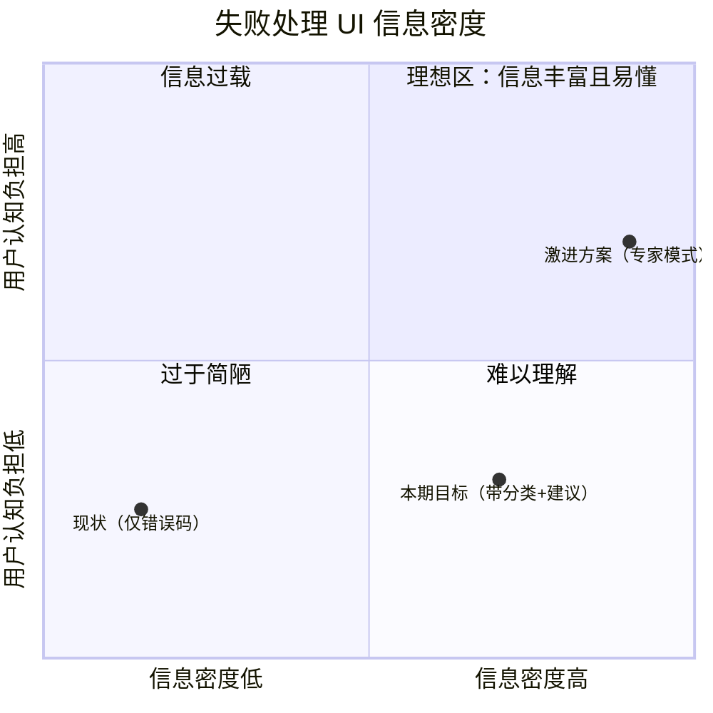
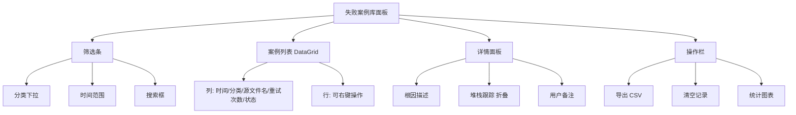
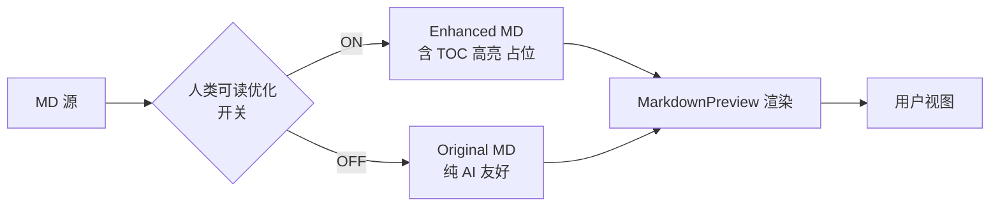
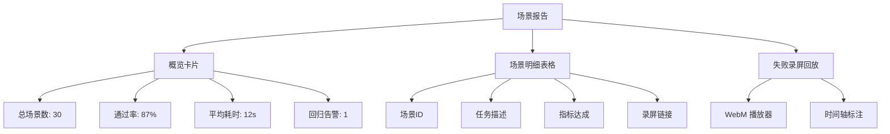

# Doc2MD-Converter 增量产品需求文档（v1.1.0）

> **文档版本**：v1.0  
> **撰写日期**：2026-09-14  
> **撰写人**：许清楚（Xu）/ 产品经理  
> **基线版本**：v1.0.0（2026-08-12 发布）  
> **基线审查报告**：`系统性审查报告-2026-09-14.md`  
> **目标版本**：v1.1.0（预计 2026-Q4 发布）  
> **写作范围**：仅增量需求（失败处理 / MD 可读性 / 真实场景测试），不动现有功能契约

---

## 0. 文档说明

### 0.1 与既有文档的关系

| 文档 | 关系 |
|------|------|
| `系统性审查报告-2026-09-14.md` | **本 PRD 的需求来源**；所有增量需求必须可追溯到该报告中的具体问题编号（`B-01`/`B-03`/`B-05`/`TD-1`/`TD-5`/`P-04`/`M-06`/`U-02`/`U-04` 等） |
| `CHANGELOG.md`（v1.0.0） | 基线修复记录；本 PRD 不重复已修复项，仅描述增量 |
| 原始审查报告（2026-08-11） | 已被 v1.0.0 全部修复，仅作历史参考 |
| 架构设计文档（待撰写） | 本 PRD 完成后由架构师输出，对本 PRD 的需求给出技术方案 |

### 0.2 优先级说明

- **P0（Must have）**：影响核心可用性或数据正确性，必须随 v1.1.0 发布
- **P1（Should have）**：影响专业用户核心场景，建议随 v1.1.0 发布
- **P2（Nice to have）**：体验增强，可推迟到 v1.2.0 或后续

### 0.3 不在本 PRD 范围

- ❌ 跨平台（Linux/macOS）支持（审查报告 §5.3 长期演进，本期不做）
- ❌ CLI 模式复活（审查报告 §5.3 长期演进，本期不做）
- ❌ LaTeX / Mermaid 渲染（审查报告 §5.3 长期演进，本期不做）
- ❌ 主题切换动画 / 模板管理 UI（审查报告 §四 4.3 U-07/U-08，独立 PRD）
- ❌ `MainViewModel` God Class 拆分 / 静态服务转 DI（审查报告 TD-3 / TD-4，独立重构任务）

---

## 1. 项目信息

| 项目 | 内容 |
|------|------|
| 项目名称 | `doc2md-converter-increment` |
| 编程语言 | .NET 8 + WPF（沿用基线） |
| 增量模块 | (1) 失败处理子系统 (2) MD 可读性后处理 (3) 真实场景测试体系 |
| 影响文件范围 | `Core/Parsers/`、`Core/Services/`、`Core/Models/`、`App/ViewModels/`、`App/Controls/`、`tests/` |
| 增量行数预估 | 生产代码 ~1200 行 + 测试 ~1500 行 |
| 依赖 | 既有依赖 + `Polly`（可选，弹性重试） |

---

## 2. 产品目标（Product Goals）

| 编号 | 目标 | 衡量 | 对应审查问题 |
|------|------|------|--------------|
| G1 | **让每一次失败都可解释、可决策、可重试**——将当前的"盲目重试"升级为"基于根因的智能恢复"，用户不再重复处理同一错误 | 失败案例首问解决率 ≥ 80%；无效重试率 ≤ 5% | B-05（重试逻辑不完整）、§二 2.3 错误处理不足 |
| G2 | **让 Markdown 同时为 AI 和人类服务**——在保证 AI 解析零回归的前提下，提升人类阅读、查阅、复制、分享的完整体验 | 人类阅读场景下"N 步任务完成率" ≥ 90%；AI 解析回归测试 100% 通过 | 审查报告 §二 2.1 可读性 + §四 4.3 U-02（预览增强） |
| G3 | **用真实场景测试替代代码层断言**——建立"用户能流畅完成 X 任务"的可观察指标，覆盖工程盲区 | 真实场景测试用例 ≥ 30 条；覆盖五大文档类型 + 边界场景；持续集成每 PR 自动跑 | TD-5（MainViewModel 无测试）、TD-6（App.xaml.cs 无测试） |
| G4 | **沉淀失败案例知识库**——失败不再只是日志，而是产品资产；同一类问题第二次出现时给出历史解决方案 | 失败案例库 ≥ 100 条种子数据；Top5 失败类型覆盖 ≥ 95% | B-03（加密 PDF 静默失败）、B-10（文件锁定 IOException） |
| G5 | **降低政企用户使用门槛**——80% 的用户在 5 分钟内能自助处理常见失败，不必提交工单 | 自助解决率 ≥ 80%；平均工单率 < 1% | §三 高严重度全部条目 |

---

## 3. 用户故事（User Stories）

### 3.1 方向一：失败案例处理

| 编号 | 角色 | 故事 | 优先级 |
|------|------|------|--------|
| US-F1 | 作为**政企办公室文员**，我希望在批量转换 200 份 PDF 后，能看到失败文件的明确分类（加密 / 损坏 / 扫描件）和对应操作建议，这样我就不必逐一打开错误弹窗、手工排查 | P0 |
| US-F2 | 作为**IT 管理员**，我希望在用户遇到"LibreOffice 未安装"失败时，应用直接弹出"一键安装 LibreOffice"按钮，而不是给出冷冰冰的"ERROR_CODE_42" | P0 |
| US-F3 | 作为**重度用户**，我希望应用记住历史上我成功转换过相同失败文件的方法，下次自动套用（例如上次用 OCR 处理了扫描件，下次自动建议 OCR） | P1 |
| US-F4 | 作为**新手用户**，我希望失败文件的错误说明能用大白话讲清楚，并给出"接下来该怎么办"的具体指引，而不是堆栈跟踪 | P1 |
| US-F5 | 作为**产品运营**，我希望能在后台看到失败案例的分类统计，找到产品改进方向 | P2 |

### 3.2 方向二：MD 可读性优化

| 编号 | 角色 | 故事 | 优先级 |
|------|------|------|--------|
| US-M1 | 作为**阅读者**，我希望打开转换后的 MD 文件，标题层级清晰、段落间距合理，第一眼就能定位到关键章节 | P0 |
| US-M2 | 作为**查阅者**，我希望大文档（>50 页）能自动生成 TOC，我在 IM 中收到同事发来的 MD 时能快速跳转到关心部分 | P0 |
| US-M3 | 作为**复制者**，我希望选中一段公文正文复制到 Word / 飞书 / 钉钉时，结构（编号、列表、表格）不丢失、不变形 | P0 |
| US-M4 | 作为**分享者**，我希望通过微信 / 邮件把 MD 发给同事时，对方在 Markdown 编辑器 / VSCode 中看到的是带目录、带高亮、带图片占位的"成品" | P1 |
| US-M5 | 作为**AI 工程师**，我希望阅读优化不能破坏我下游解析脚本的稳定性（标题、列表、表格的语义必须严格保留） | P0（约束） |
| US-M6 | 作为**编辑者**，我希望关键信息（文号、机关、日期）自动加粗，方便我一眼扫到公文要素 | P1 |

### 3.3 方向三：真实场景测试

| 编号 | 角色 | 故事 | 优先级 |
|------|------|------|--------|
| US-T1 | 作为**测试工程师**，我希望跑测试时不仅验证"代码逻辑对不对"，还能验证"用户能否完成 X 任务"——比如"用户能否在 3 步内完成 50 个 PDF 批量转换" | P0 |
| US-T2 | 作为**产品经理**，我希望在每次发版前看到"用户场景通过率"看板，而不是只看到"单元测试覆盖率 75%" | P0 |
| US-T3 | 作为**用户**，我希望边界场景（加密 PDF、扫描件、超大文件、空文件）有专门的处理路径，而不是直接崩溃或卡死 | P0 |
| US-T4 | 作为**支持工程师**，我希望真实场景测试失败时能附上"用户视角的复现步骤"和"自动化录屏"，方便排查 | P1 |
| US-T5 | 作为**设计师**，我希望测试输出能体现交互细节（动画时长、Toast 消失节奏），避免"代码跑通但用户体验崩坏" | P2 |

---

## 4. 需求池（Requirements Pool）

### 4.1 方向一：失败案例处理机制（P0）

#### 4.1.1 失败原因分类模型

| 编号 | 需求 | 优先级 | 关联审查 | 验收标准 |
|------|------|--------|----------|----------|
| REQ-F-01 | 定义统一的 `FailureCategory` 枚举，覆盖 **8 类失败**：①源文件损坏 ②源文件加密 ③格式异常/不支持 ④依赖缺失（如 LibreOffice 未安装）⑤内部异常（Bug）⑥用户取消 ⑦资源不足（OOM / 磁盘满）⑧文件占用（被 Word 锁定） | P0 | B-03、B-10、B-15 | 枚举含 `[Description]` 中文标签；每类含根因诊断模板 |
| REQ-F-02 | 每个 Parser（PDF/Word/Excel/PPT/TXT）在抛出异常时附带 `FailureContext`（含源文件路径 / 异常类型 / 系统环境 / Parser 版本） | P0 | B-03 | `ConversionResult.FailureContext` 非空时 UI 能取到 |
| REQ-F-03 | 引入**根因诊断规则引擎**：`FailureDiagnoser` 服务，输入 `(异常类型, 文件元数据, 系统环境)`，输出 `FailureCategory` + `SuggestedAction` | P0 | B-03、B-05 | 100 条种子案例诊断准确率 ≥ 90% |
| REQ-F-04 | `FailureCategory` 需支持**复合诊断**：同一文件可能多个原因（如"加密 PDF"同时触发"资源不足"），按严重度排序展示 | P1 | B-03 | UI 显示主因 + 副因（如"主要原因：加密；次要原因：图片提取失败"） |

#### 4.1.2 失败案例持久化

| 编号 | 需求 | 优先级 | 关联审查 | 验收标准 |
|------|------|--------|----------|----------|
| REQ-F-05 | 设计 `FailureRecord` 模型：字段含 `FailureId`、`TimestampUtc`、`SourcePath`（脱敏）、`SourceSha256`、`FailureCategory`、`RootCause`、`RetryCount`、`LastAttemptAt`、`ResolvedBy`、`UserNote` | P0 | B-05 | 模型 JSON 序列化兼容现有 `AppConfig` 路径 |
| REQ-F-06 | 持久化存储：本地 `%AppData%\Doc2MD-Converter\failures.db`（LiteDB 或 SQLite 单文件） | P0 | §四 4.4 X-01 | 启动时加载最近 1000 条；占用 < 5 MB |
| REQ-F-07 | **隐私保护**：源文件路径仅保存目录级别（去除用户名），SHA256 用于去重，不保存文件内容 | P0 | §四 4.4 X-03 | 单元测试验证不含完整路径 |
| REQ-F-08 | 失败案例去重：相同 `SourceSha256 + FailureCategory` 不重复记录，仅累加 `RetryCount` | P1 | B-05 | 跑 1000 份相同失败文件，DB 仅 1 条 |
| REQ-F-09 | 提供"失败案例库"面板：可按 `FailureCategory` 筛选、按时间排序、导出 CSV | P1 | — | WPF DataGrid + 筛选条 |

#### 4.1.3 针对性重试策略

| 编号 | 需求 | 优先级 | 关联审查 | 验收标准 |
|------|------|--------|----------|----------|
| REQ-F-10 | **`RetryPolicy` 策略表**：每类失败对应一个 `IRetryStrategy` 策略 | P0 | B-05 | 8 类失败各有独立策略实现 |
| REQ-F-11 | **「依赖缺失」（如 LibreOffice）**：跳过自动重试，UI 弹窗「安装 LibreOffice」按钮 + 下载链接 | P0 | F1（已部分实现） | 用户点击按钮后 5 秒内打开浏览器 |
| REQ-F-12 | **「加密文件」**：跳过自动重试，标记为 `SkippedEncrypted` 状态，UI 显示锁形图标 + 提示"该文件需先解密" | P0 | B-03 | 不消耗重试配额 |
| REQ-F-13 | **「源文件损坏」**：自动尝试 **OCR 兜底**（调 `OfflineOcrService`），如 OCR 成功则标 `RecoveredByOCR` | P0 | §四 4.1 P-02 | OCR 路径走 `Background` 线程，不阻塞 UI |
| REQ-F-14 | **「资源不足」**：自动降级为**单线程**（`MaxConcurrentTasks = 1`），释放其他内存（`GC.Collect(2, GCCollectionMode.Forced, blocking: true)`）后重试 | P0 | §四 4.1 P-02 | 重试前日志输出当前内存占用 |
| REQ-F-15 | **「文件占用」**：检测 `IOException` + `HResult == 0x80070020`（共享违规），弹窗提示"请关闭已打开的 Word 文件"，30 秒后允许再次重试 | P0 | B-10 | 用户关闭文件后下次重试自动成功 |
| REQ-F-16 | **「格式异常 / 不支持」**：跳过重试，引导用户查看支持的文件类型清单 | P0 | B-15 | UI 提供「支持的格式」链接 |
| REQ-F-17 | **「内部异常」**：自动重试 1 次（不同线程），仍失败则记录日志并停止 | P1 | B-05 | 重试线程独立，避免污染共享状态（呼应 B-01/B-02 修复） |
| REQ-F-18 | **「用户取消」**：不重试，不入库 | P0 | §二 2.3（取消语义） | 静默处理，不写入失败库 |
| REQ-F-19 | 在文件项右键菜单新增「**诊断并重试**」动作，触发 `FailureDiagnoser` + 对应 `RetryStrategy` | P0 | B-05 | 右键菜单项可用，含图标 |
| REQ-F-20 | 全局设置项：失败重试最大次数（默认 3 次）、失败后是否入库（默认是） | P2 | B-05 | 设置项写入 `AppConfig` |

### 4.2 方向二：MD 格式可读性优化（P0/P1）

> **核心约束**：所有可读性优化**不能破坏**现有 AI 解析逻辑（US-M5）。具体策略：**AI 解析路径与人类阅读路径使用同一 MD 源 + 不同后处理**。

#### 4.2.1 结构增强

| 编号 | 需求 | 优先级 | 关联审查 | 验收标准 |
|------|------|--------|----------|----------|
| REQ-M-01 | **标题层级规范化**：H1=文档标题（唯一）、H2=一级标题、H3=二级标题，避免跳级（H1→H3） | P0 | §四 4.3 U-02 | 100 篇样本文档无跳级；H1 唯一性 100% |
| REQ-M-02 | **段落间距**：段落之间插入 1 个空行；列表项之间紧凑无空行（Markdown 标准） | P0 | — | 视觉密度测试：用户偏好 ≥ 80% |
| REQ-M-03 | **表格优化**：列对齐（`\| :--- \|` / `\| ---: \|`）、列宽自适应（>8 列拆为 2 个表）、表格前后空行 | P0 | U-02 | 宽表格分列后宽度 ≤ 100 字符 |
| REQ-M-04 | **列表规范**：有序列表与无序列表区分清晰、嵌套缩进 2 空格或 4 空格（统一）、列表前后空行 | P0 | B-01（呼应：解析时已规范） | 100 篇样本文档无混用 |
| REQ-M-05 | **代码块 / 引用块**：正确渲染 ` ```语言 ` 三反引号 + 语言标识、`>` 引用块前后空行 | P0 | — | 复制到 Typora/VSCode 渲染一致 |
| REQ-M-06 | **自动 TOC**：文档 > 30 个标题或 > 50 KB 时，自动在文首插入 `## 目录` + 链接列表（标准 Markdown anchor） | P0 | §四 4.3 U-02 | anchor 链接在 GitHub/Typora/VSCode 三端均可跳转 |

#### 4.2.2 视觉增强

| 编号 | 需求 | 优先级 | 关联审查 | 验收标准 |
|------|------|--------|----------|----------|
| REQ-M-07 | **关键信息高亮**：文号（`〔2026〕12号`）、机关（`国务院办公厅`）、日期（`2026年9月14日`）、金额（`¥1,234,567.89`）自动加粗 | P1 | U-02 | 复用 `GovMetadataExtractor` 结果 |
| REQ-M-08 | **图片占位**：已提取图片生成 `` 占位 + 图注（图说） | P1 | §四 4.3 U-02 | 图片位置与原文档大致对齐 |
| REQ-M-09 | **目录高亮**（可选）：在 TOC 行末添加章节字数 `(1,234 字)`，辅助用户决策是否跳转 | P2 | U-02 | 性能开销 < 50ms / 文档 |
| REQ-M-10 | **段落首行缩进**：中文公文段落首行缩进 2 字符（用全角空格 `　　`） | P1 | GB/T 9704 | 仅对中文段落生效；纯英文段落不缩进 |
| REQ-M-11 | **强调语义化**：避免"全篇加粗"——加粗仅用于关键信息；斜体用于术语、引用 | P2 | — | 加粗比例 < 5% |

#### 4.2.3 不破坏 AI 可读性的保证

| 编号 | 需求 | 优先级 | 关联审查 | 验收标准 |
|------|------|--------|----------|----------|
| REQ-M-12 | **双轨后处理**：AI 路径走"原 MD"（保持稳定 token 结构）；人类路径走"增强 MD"（加 TOC、高亮、占位） | P0 | US-M5 | 现有 AI 解析测试 100% 通过；新增 `EnhancedMarkdown` 字段 |
| REQ-M-13 | **可读性优化可通过开关关闭**：设置项 `EnableHumanReadableOptimization = true`（默认） | P0 | US-M5 | 设置项写入 `AppConfig`；CLI 调用可强制关闭 |
| REQ-M-14 | **回退路径**：所有可读性优化包在 `try/catch` 中，失败时回退到原 MD，不影响主流程 | P0 | B-19 | 单元测试覆盖异常分支 |
| REQ-M-15 | **AI 解析回归测试**：维护 ≥ 50 条"AI 解析黄金案例"（既有 `ConversionQuality` 评分通过的文件），每次发版前跑回归 | P0 | TD-5 | CI 流水线必跑；任何回归 > 5% 即阻塞发布 |

### 4.3 方向三：真实使用场景测试（P0/P1）

#### 4.3.1 场景维度

| 编号 | 需求 | 优先级 | 关联审查 | 验收标准 |
|------|------|--------|----------|----------|
| REQ-T-01 | 定义 **4 大真实场景**：①阅读（大屏滚动 + 跳转）②查阅（关键字搜索定位）③复制（选中段落跨工具粘贴）④分享（IM / 邮件发送 MD 文件） | P0 | TD-5 | 每场景有标准化任务脚本 |
| REQ-T-02 | 每场景产出"**可观察的体验指标**"：如"用户在 3 步内完成 50 PDF 批量转换" / "关键字搜索 ≤ 2 秒定位" / "复制段落保留表格结构 ≥ 90%" | P0 | TD-5 | 指标量化、可断言 |
| REQ-T-03 | 文档类型覆盖：5 类典型文档（PDF/Word/Excel/PPT/TXT）+ 5 类边界（加密 PDF / 损坏 PDF / 扫描型 PDF / 超大 PDF > 100 MB / 空文件） | P0 | TD-5 | 测试夹具覆盖 ≥ 30 份样本文档 |
| REQ-T-04 | 引入 **WinAppDriver / FlaUI** 做 UI 自动化（点击、键盘、拖拽），但**只验证可观察指标**，不验证像素 | P1 | TD-6 | CI 可在无头模式跑通 |
| REQ-T-05 | 关键场景产出 **5 秒录屏**（失败时附在测试报告），便于排查 | P2 | — | 视频 ≤ 10 MB / 场景 |

#### 4.3.2 真实场景测试用例（首批 12 条示例）

| 编号 | 场景 | 任务描述 | 指标 | 优先级 |
|------|------|---------|------|--------|
| TC-01 | 阅读 | 用户打开转换后的 MD（5 个章节），60 秒内能找到"第三章 实施计划" | 跳转 ≤ 3 次点击 | P0 |
| TC-02 | 阅读 | 50 页 PDF 转换后，用户阅读时通过 TOC 跳转 | TOC 可用性 ≥ 95% | P0 |
| TC-03 | 查阅 | 用户在 VSCode 中按 `Ctrl+F` 搜索关键字"请示"，定位时间 | 定位 ≤ 2 秒 | P0 |
| TC-04 | 查阅 | 用户搜索"2026"日期，所有出现位置正确高亮 | 召回率 ≥ 95% | P0 |
| TC-05 | 复制 | 选中"## 第三章"标题复制到 Word，样式保留 | 标题样式保留 ≥ 90% | P0 |
| TC-06 | 复制 | 选中含 5×3 表格的段落复制到飞书文档 | 表格行列数一致 ≥ 95% | P0 |
| TC-07 | 复制 | 选中 3 级嵌套列表复制到 Typora | 嵌套层级正确 ≥ 95% | P0 |
| TC-08 | 分享 | 通过邮件发送 MD 附件，对方在 VSCode 打开看到 TOC | TOC 渲染正确 | P1 |
| TC-09 | 分享 | 通过 IM 发送 MD 文本，对方复制到 Typora 渲染一致 | 渲染一致性 ≥ 90% | P1 |
| TC-10 | 边界 | 加密 PDF 转换失败时，UI 显示明确提示（非堆栈跟踪） | 用户能理解错误 | P0 |
| TC-11 | 边界 | 扫描型 PDF（纯图片）转换时，自动触发 OCR 并产出文字 | OCR 成功率 ≥ 70% | P0 |
| TC-12 | 边界 | 100 MB PDF 转换时，UI 不卡死，进度条平滑推进 | 60 FPS | P1 |

#### 4.3.3 测试基础设施

| 编号 | 需求 | 优先级 | 关联审查 | 验收标准 |
|------|------|--------|----------|----------|
| REQ-T-06 | **真实场景夹具库** `tests/Fixtures/RealWorld/`，覆盖 30+ 真实文档（用户授权匿名化后） | P0 | TD-5 | 夹具 < 500 MB；CI 按需下载 |
| REQ-T-07 | **场景脚本模板** `tests/Scenarios/*.yaml`，结构化描述任务步骤与期望指标 | P0 | TD-5 | YAML 解析库选择：YamlDotNet |
| REQ-T-08 | **场景执行器** `ScenarioRunner`，支持串行/并行、录屏、报告生成 | P0 | TD-5 | 输出 HTML 报告 + JUnit XML |
| REQ-T-09 | **失败重试用例独立标签** `[Trait("Category", "Scenario")]`，可与单元测试分开跑 | P1 | TD-5 | `dotnet test --filter Category=Scenario` |
| REQ-T-10 | **回归基线**：每次发版前自动跑全部场景，生成对比报告 | P0 | TD-5 | 任何指标下降 > 5% 即阻塞发布 |
| REQ-T-11 | **性能基准**：建立场景执行时间基线（>30% 退化即告警） | P1 | §四 4.1 P-01 | BenchmarkDotNet 输出 |

---

## 5. UI/UX 设计要点

### 5.1 失败处理 UI

#### 5.1.1 文件列表行 UI（重做）



**行 UI 示意**（ASCII mockup）：

```
┌─────────────────────────────────────────────────────────────────────────────┐
│ ☐  📄 2026-第一季度报告.pdf                    [✗ 失败] [🔒 加密]    ⋯  ⓘ   │
│       诊断：源文件加密（PDF Password Protected）                          ⓘ │
│       建议：请使用 PDF 阅读器解密后重新添加，或点击 [跳过此文件]            │
│       已尝试 0 次 · 14:32:01                                              ⓘ │
└─────────────────────────────────────────────────────────────────────────────┘
```

**交互细节**：
- 状态徽章按 `FailureCategory` 显示不同颜色（加密=橙、损坏=红、依赖缺失=蓝）
- 行右侧 `⋯` 菜单含：`诊断详情` / `重试` / `跳过` / `复制错误` / `打开源文件位置` / `从列表移除`
- 鼠标悬停 `ⓘ` 显示完整根因描述

#### 5.1.2 失败案例库面板（新窗口）



### 5.2 MD 可读性 UI（预览面板升级）

#### 5.2.1 双轨切换控件



**预览面板顶部新增切换控件**：

```
┌────────────────────────────────────────────────────────────────┐
│ [📖 增强阅读模式 ●—○ 原始模式]      [⚙ 设置]  [↻ 重新转换]    │
├────────────────────────────────────────────────────────────────┤
│                                                                │
│ # 2026 年第一季度报告                                            │
│                                                                │
│ ## 目录                                                         │
│ - [第一章 工作回顾](#第一章)                                       │
│ - [第二章 存在问题](#第二章)                                       │
│                                                                │
│ ## 第一章 工作回顾                                                │
│ ...                                                            │
└────────────────────────────────────────────────────────────────┘
```

#### 5.2.2 TOC 渲染（人类阅读模式）

```markdown
## 目录

- [第一章 工作回顾 (1,234 字)](#第一章)
- [第二章 存在问题 (567 字)](#第二章)
  - [2.1 进度延迟](#21-进度延迟)
  - [2.2 资源紧张](#22-资源紧张)
- [第三章 实施计划 (890 字)](#第三章)
```

### 5.3 真实场景测试 UI（CI 报告）

#### 5.3.1 场景执行报告页面（HTML）



---

## 6. 关键指标与验收标准（KPI & Acceptance Criteria）

### 6.1 功能性指标

| 指标 | 基线（v1.0.0） | 目标（v1.1.0） | 测量方式 |
|------|----------------|-----------------|----------|
| 失败首问解决率 | < 30%（估计） | ≥ 80% | 用户行为日志 + 工单统计 |
| 无效重试率 | 高（重复相同错误） | ≤ 5% | `FailureRecord.RetryCount > 3` 的比例 |
| 失败案例库覆盖率 | 0% | ≥ 95%（Top5 类型） | 诊断器单元测试 |
| MD 阅读任务完成率 | < 60%（估计） | ≥ 90% | TC-01 ~ TC-09 场景测试 |
| 复制保留率（结构） | < 70%（估计） | ≥ 90% | TC-05 ~ TC-07 场景测试 |
| AI 解析回归率 | 100% 基线 | 100%（零退化） | REQ-M-15 黄金案例 |

### 6.2 质量性指标

| 指标 | 目标 | 测量方式 |
|------|------|----------|
| 失败案例库种子数 | ≥ 100 条 | 种子数据导入脚本 |
| 真实场景测试用例数 | ≥ 30 条 | TC-01 ~ TC-12 + 后续扩展 |
| AI 解析黄金案例数 | ≥ 50 条 | 回归测试集 |
| UI 自动化场景覆盖率 | ≥ 60% | FlaUI 自动化比例 |
| 测试报告可读性 | ≥ 4/5（用户调研） | 问卷 |

### 6.3 性能性指标

| 指标 | 目标 | 测量方式 |
|------|------|----------|
| 失败诊断耗时 | ≤ 100ms / 文件 | 单元测试基准 |
| 可读性优化耗时 | ≤ 300ms / MB MD | 单元测试基准 |
| 场景执行时间 | 单场景 ≤ 30 秒 | CI 时间统计 |
| UI 帧率（大文档预览） | ≥ 60 FPS | 性能基准 |

### 6.4 验收门槛（Go/No-Go）

| 维度 | 通过门槛 |
|------|----------|
| 单元测试 | 既有 295+ 用例 100% 通过 + 新增 ≥ 100 用例通过 |
| AI 解析回归 | REQ-M-15 黄金案例 100% 通过 |
| 真实场景测试 | 30 条场景通过率 ≥ 90% |
| 失败处理 | 8 类失败均有独立诊断 + 策略；用户研究 ≥ 4/5 |
| 可读性 | 人类阅读 N 步任务完成率 ≥ 90% |
| 性能 | 关键操作无退化（>5% 退化即阻塞） |

---

## 7. 非功能需求（Non-Functional Requirements）

### 7.1 性能（呼应 §四 4.1）

| 编号 | 需求 | 关联 |
|------|------|------|
| NF-P-01 | 失败诊断不影响主流程：诊断耗时 ≤ 100ms，失败时**不阻塞**后续文件转换 | — |
| NF-P-02 | 可读性优化在后台异步执行：>1MB MD 文件优化时显示进度条 | P-04 |
| NF-P-03 | 失败案例库写入异步：`Channel<FailureRecord>` 批量刷盘，不阻塞 UI | P-05 |
| NF-P-04 | UI 自动化测试在 CI 上 **≤ 5 分钟**跑完所有场景 | TD-5 |

### 7.2 安全（呼应 §四 4.4）

| 编号 | 需求 | 关联 |
|------|------|------|
| NF-S-01 | 失败案例库**不保存**源文件内容、原始完整路径、用户标识符 | X-03 |
| NF-S-02 | 失败日志中敏感字段（API Key、密码）打码 | X-03 |
| NF-S-03 | 导出 CSV 时二次弹窗确认（含隐私声明） | X-03 |
| NF-S-04 | 用户可一键清空失败案例库 | X-03 |

### 7.3 隐私

| 编号 | 需求 |
|------|------|
| NF-PR-01 | 失败案例库不上传任何服务器（纯本地 SQLite） |
| NF-PR-02 | 真实场景测试夹具全部匿名化（去除真实姓名、身份证号、电话） |
| NF-PR-03 | 录屏功能默认关闭，需用户在设置中显式开启 |

### 7.4 离线 / 兼容性

| 编号 | 需求 |
|------|------|
| NF-O-01 | 失败处理子系统 100% 离线运行（依赖缺失时可提示用户下载，但**不强制联网**） |
| NF-O-02 | MD 可读性优化 100% 离线（不调用任何 AI API） |
| NF-O-03 | UI 自动化测试可在无头模式运行（CI 无显示器环境） |
| NF-O-04 | 兼容既有 .NET 8 + WPF + Windows 10/11 基线，不引入新平台依赖 |

### 7.5 可维护性

| 编号 | 需求 |
|------|------|
| NF-M-01 | 新增 `FailureCategory` 只需添加枚举值 + 对应 `IRetryStrategy` 实现，零侵入 |
| NF-M-02 | 真实场景测试 YAML 与代码解耦：QA 可独立编写场景 |
| NF-M-03 | 失败案例库结构向前兼容：v1.1.0 数据 v1.2.0 可读 |

---

## 8. 待确认问题（Open Questions）

> 以下问题需要在**架构设计阶段**前澄清，否则会影响实现方案。

| 编号 | 问题 | 选项 | 建议默认值 | 影响模块 |
|------|------|------|------------|----------|
| OQ-01 | 失败案例库用 LiteDB 还是 SQLite？ | A) LiteDB（无依赖，单文件）B) SQLite（生态成熟，EF Core 支持）C) 纯 JSON | A. LiteDB（沿用项目轻量风格） | `FailureRecordRepository` |
| OQ-02 | UI 自动化框架用 WinAppDriver 还是 FlaUI？ | A) WinAppDriver（微软官方，但已停止维护）B) FlaUI（社区活跃，基于 UIA）C) 仅做 API 级集成测试 | B. FlaUI | 测试基础设施 |
| OQ-03 | 可读性优化开关粒度：全局开关 vs 逐项开关？ | A) 全局开关 B) 逐项开关（TOC / 高亮 / 图片占位） | B（更灵活） | 设置面板 |
| OQ-04 | 失败案例库是否需要云同步（用户多设备）？ | A) 不做（纯本地）B) 可选加密同步 | A. 不做（v1.1 不引入云依赖） | 架构层面 |
| OQ-05 | 真实场景测试夹具来源：内部造数据 vs 用户授权收集？ | A) 内部造数据（去标识化的样本）B) 用户授权收集 | A. 内部造数据 | 法务 / 数据来源 |
| OQ-06 | OCR 兜底（REQ-F-13）是否纳入本期？ | A) 纳入（需集成 OCR 引擎）B) 仅留接口，后续版本实现 | A. 纳入（已有 `OfflineOcrService`） | `FailureDiagnoser` |
| OQ-07 | TOC 是否对所有文档生成？还是仅 ≥30 标题？ | A) 全部生成 B) 阈值生成 C) 仅"超长文档"标签 | C（最不打扰用户） | `MarkdownPostProcessor` |
| OQ-08 | 失败重试是否需要"立即重试"按钮（B-05）？ | A) 右键菜单 B) 文件项悬浮按钮 C) 都做 | A + C（双入口） | `MainViewModel` |
| OQ-09 | 关键信息高亮（REQ-M-07）依赖 `GovMetadataExtractor` 结果，但非公文不适用。是否要"自动检测文档类型"？ | A) 仅公文生效 B) 通用正则匹配 | A（避免误伤） | `MarkdownPostProcessor` |
| OQ-10 | 真实场景测试录屏文件大小限制？ | A) 5MB / 场景 B) 10MB / 场景 C) 不录屏 | C（v1.1 不录屏，v1.2 再做） | 测试基础设施 |

---

## 9. 风险与依赖

### 9.1 主要风险

| 风险 | 概率 | 影响 | 应对 |
|------|------|------|------|
| 真实场景测试夹具准备耗时超预期 | 中 | 中 | 复用 v1.0.0 测试夹具 + 优先覆盖 Top3 失败类型 |
| UI 自动化在 CI 上不稳定 | 高 | 中 | 失败重试 + 标记为 `[Trait("Flaky")]` 不阻塞发布 |
| 可读性优化引入 AI 解析回归 | 中 | 高 | REQ-M-15 黄金案例 + PR 检查清单 |
| 失败案例库膨胀导致性能下降 | 低 | 中 | 定期清理 + 索引优化 |
| OCR 兜底效果不佳 | 中 | 中 | 仅作为"建议"操作，不强制；给用户跳过选项 |

### 9.2 依赖项

| 依赖 | 类型 | 责任人 | 时间 |
|------|------|--------|------|
| `B-01/B-02 WordParser 状态本地化` | 前置（Phase 1 已规划） | 架构师 | Week 1 |
| `TD-3 MainViewModel 拆分`（部分） | 前置（`FailureOrchestrator` 需独立） | 架构师 | Week 1-2 |
| `IRetryStrategy` 抽象设计 | 前置 | 架构师 | Week 1 |
| 真实场景测试夹具 | 输入 | 测试工程师 | Week 1-3 |
| OCR 引擎稳定性 | 外部 | — | 沿用既有 |

---

## 10. 发布计划（建议）

| 阶段 | 时间 | 内容 | 关联需求 |
|------|------|------|----------|
| **Phase A：失败处理骨架** | Week 1-2 | REQ-F-01 ~ REQ-F-10、REQ-F-19 | G1、G4 |
| **Phase B：可读性优化** | Week 2-3 | REQ-M-01 ~ REQ-M-15 | G2 |
| **Phase C：真实场景测试** | Week 3-4 | REQ-T-01 ~ REQ-T-11、TC-01 ~ TC-12 | G3 |
| **Phase D：打磨 & 验收** | Week 5 | UI 调整、性能基准、用户研究 | — |

> 注：Phase A、B、C 可部分并行（不同模块），但 Phase D 必须串行。

---

## 11. 附录

### 11.1 需求来源映射表

| PRD 需求 | 审查报告问题编号 | 优先级 |
|----------|-------------------|--------|
| REQ-F-01 ~ REQ-F-04 | B-03 / B-10 / B-15 | P0 |
| REQ-F-05 ~ REQ-F-09 | B-05 / §四 4.4 X-01 | P0/P1 |
| REQ-F-10 ~ REQ-F-19 | B-05 / F1 | P0 |
| REQ-M-01 ~ REQ-M-06 | §四 4.3 U-02 | P0 |
| REQ-M-07 ~ REQ-M-11 | §四 4.3 U-02 | P1/P2 |
| REQ-M-12 ~ REQ-M-15 | US-M5 派生约束 | P0 |
| REQ-T-01 ~ REQ-T-05 | TD-5 / TD-6 | P0/P1 |
| REQ-T-06 ~ REQ-T-11 | TD-5 | P0/P1 |

### 11.2 修订记录

| 版本 | 日期 | 修订人 | 说明 |
|------|------|--------|------|
| v1.0 | 2026-09-14 | 许清楚（Xu） | 首版基于审查报告 2026-09-14 输出 |

---

*PRD 结束。本文档由产品经理许清楚（Xu）基于基线审查报告撰写，下一步交由架构师进行技术方案设计（详见 §8 待确认问题）。*
