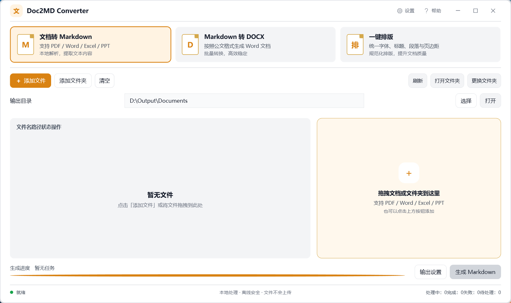
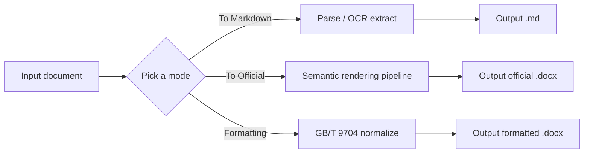

<div align="center">

# Doc2MD Converter

**Offline document conversion & Chinese official-document formatting for Windows**

[](LICENSE)


[中文](../README.md) · [Changelog](../CHANGELOG.md)

</div>

Batch document input → format conversion / official-document typesetting → output to a target directory. Built for government & enterprise office scenarios, with the GB/T 9704-2012 official document standard built in. Supports Chinese and English UI. All processing happens locally — **your documents never leave your machine**.



## Quick Start

**End users (no build needed):**

1. Download the latest Windows package from [Releases](../../releases) (self-contained single file, no .NET install required)
2. Unzip and double-click `Doc2MD.Converter.exe`
3. Drag documents into the window (or click "Add Files / Add Folder")
4. Choose the output directory, click "Generate", and find the results in the output directory

**Developers:** see [Build & Run](#build--run) below.

## Features

### 1. Documents to Markdown

Batch-convert the following formats to Markdown:

| Format | Notes |
|--------|-------|
| PDF | Direct parsing for text-based PDFs; optional OCR for scanned PDFs |
| DOC / DOCX | Word documents (legacy `.doc` via LibreOffice / COM dual fallback) |
| XLS / XLSX | Excel spreadsheets, table structure preserved |
| PPT / PPTX | Presentation text extraction |
| TXT / Markdown | Copied as-is |

- Preserves headings, tables, lists, blockquotes, code blocks
- Extracts document metadata (document number, issuing authority, date, document type, topic keywords)
- Automatically strips AIGC watermarks (6 categories: frontmatter blocks, zero-width characters, etc.)
- Quality scoring with import recommendations (`recommended` / `review` / `skip`)

### 2. Markdown to Official DOCX

- Compliant with GB/T 9704-2012 (official document format standard for Party and government organs)
- Built-in templates: Official Report, Meeting Minutes
- Custom Word template support (clones template styles and section settings)
- Table of contents generation, header/footer support, Chinese typography (方正小标宋简体 / 黑体 / 仿宋_GB2312 / 楷体_GB2312)

### 3. One-Click Formatting of DOCX

- Automatically normalizes fonts, sizes, line spacing, page margins, first-line indent per GB/T 9704-2012
- Three built-in formatting profiles: Standard Official, Enterprise Enhanced, Academic Paper
- Profile import/export support

## Example

Drag in a PDF / Word document with "Documents to Markdown" mode:

```text
Input:  meeting-notes.docx (headings, table, list)
        │
        ▼
Output: meeting-notes.md

# Meeting Notes

## Time
2026-08-12 09:30

| Topic              | Result |
|--------------------|--------|
| H1 business review | Approved |

- Project A: on schedule
- Project B: needs coordination
```

"Markdown to Official DOCX" applies the GB/T 9704-2012 layout automatically — one click to a print-ready official document.

## UI & Interaction

- Three-mode card switching (To Markdown / To DOCX / Formatting)
- Drag-and-drop file/folder import, batch processing with live progress
- Conversion preview panel (semantic Markdown rendering)
- Conversion history (last 20 records)
- Keyboard shortcuts: `Ctrl+O` add files, `Ctrl+Shift+O` add folder, `F5` refresh, `Ctrl+Enter` start, `Esc` cancel, `Ctrl+Z` undo clear
- First-run onboarding guide
- Chinese / English UI switch (in Settings)

## Architecture

```
Doc2MD.Converter.slnx
├── src/Doc2MD.Converter.Core/    # Core engine (.NET 8, no UI dependency)
│   ├── Parsers/                  # Format parsers (PDF/Word/Excel/PPT/Text)
│   ├── Pipeline/                 # Semantic Markdown→DOCX rendering pipeline
│   ├── Services/                 # Conversion, formatting, OCR, security policy, update check
│   └── Models/                   # Config, result, metadata models
├── src/Doc2MD.Converter.App/     # WPF desktop app (.NET 8 / Windows)
│   ├── ViewModels/               # MVVM view models
│   ├── Resources/                # i18n strings (Strings.resx / Strings.en.resx)
│   └── Controls/                 # Custom controls (mode cards, etc.)
├── tests/                        # Unit & E2E tests (xUnit, 295+ cases)
│   └── fixtures/                 # Sanitized test samples
└── scripts/                      # Build / publish / smoke-test scripts
```

Processing flow:



## Requirements

- Windows 10 / 11 (x64)
- .NET 8 SDK (to build); self-contained publishing available (no .NET runtime needed to run)

Optional external tools (with clear hints when missing; core flow unaffected):

| Tool | Purpose |
|------|---------|
| LibreOffice | Legacy binary Office formats (.doc / .xls / .ppt) |
| OCRmyPDF + Tesseract (chi_sim) | OCR for scanned PDFs |

## Build & Run

```powershell
# Build
dotnet build Doc2MD.Converter.slnx

# Run tests
dotnet test tests/Doc2MD.Converter.Core.Tests/Doc2MD.Converter.Core.Tests.csproj

# Run the GUI
dotnet run --project src/Doc2MD.Converter.App

# Publish a self-contained single file (win-x64)
.\scripts\publish-win-x64.ps1
```

Publish output goes to `publish/gui/`; copy templates to `publish/templates/` as needed.

## Security & Privacy

- **Fully offline** by default — no network calls, no document upload
- External tools (OCR, LibreOffice) invoked only from local paths
- Built-in security policy: path isolation, overwrite protection, file type & size limits, Windows reserved-name sanitization
- Optional update check: only queries the GitHub Releases API; never auto-downloads, asks the user before opening the download page

## Links

- [中文 README](../README.md)
- [Changelog](../CHANGELOG.md)
- [Releases](../../releases)

## Contributing

1. Fork and clone this repository
2. Install the .NET 8 SDK
3. Run `dotnet build` to verify the build
4. Write/modify code and add unit tests
5. Run `dotnet test` to make sure all cases pass
6. Submit a Pull Request (describe the change category and rationale in the commit message)

## License

MIT License — see [LICENSE](../LICENSE).